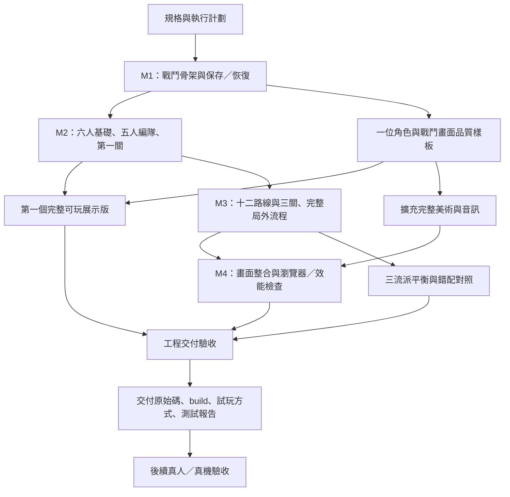

# 《星骸防線：黎明反攻》AI 開發執行計劃

版本：0.1 · 日期：2026-09-04 · 專案：SurvivalTowerDefense

產品依據：[MVP_SPEC.md](MVP_SPEC.md)

**交付目標：由 AI 完成規則、流程、本機存檔、畫面與自動化測試，再交付可於本機及同一 Wi-Fi 試玩的版本。**

本文件保留開工前的執行計劃與驗收定義；後續已依授權實作。即時完成狀態與工程證據請見 [IMPLEMENTATION_STATUS.md](IMPLEMENTATION_STATUS.md)，下方第 2.1 節為開工時的歷史基線。

## 1. 已確認的執行方式

| 項目 | 決策 |
| --- | --- |
| 實作責任 | AI 負責工程、素材整合、規則驗證、瀏覽器流程與交付文件。 |
| 推進方式 | 通過任務驗收後持續推進；每階段提供可玩版本及證據，不逐階段等待使用者批准。 |
| 工期 | 不設定固定日期，以任務依賴及完成條件控管。 |
| 首次可玩 | 優先打通一個完整關卡，再擴充三關及所有內容。 |
| 美術順序 | 先完成一位角色與一個戰鬥畫面的品質樣板，再擴充全部素材。 |
| 初期試玩 | 提供同一 Wi-Fi 可開啟的手機網址；電腦端也能操作。 |
| 儲存 | 執行文件存於本地專案；遊戲進度依規格存於目前瀏覽器的 IndexedDB。 |
| 工程交付 | AI 完成規則、流程、存檔、畫面、自動化與平衡測試後，交付可玩版。 |
| 真人／真機驗收 | 另外記錄；未取得實測資料時標為待驗證，不阻塞其他可執行的工程工作。 |
| 公開部署 | 完整 MVP 可玩後，由使用者另行決定託管及分享方式。 |

遊戲需求維持規格中的 R01–R14：手機直向、六位角色最多出戰五位、十二條專屬武器路線、三關、六至八分鐘、可控隨機、沒有農資源的戰力門檻。技術選型沿用 TypeScript、Vite、Phaser 3.90.0、HTML/CSS HUD 與 IndexedDB。

## 2. 當前基線與交付狀態

### 2.1 開工時的專案狀態（歷史）

- 目前已有產品規格 `docs/MVP_SPEC.md`。
- 本計劃寫入前，專案內沒有遊戲程式、素材、package.json 或測試。
- 尚未建立 Git 儲存庫；開工時建立本地版本紀錄。
- 本計劃的 P01–P31 全部尚未開始；列出任務不代表功能已完成。

### 2.2 區分三個完成狀態

| 狀態 | 必須具備的證據 | 目前 |
| --- | --- | --- |
| 文件就緒 | 產品規格、任務依賴、交付及驗收條件完整 | 本次文件交付 |
| 工程可玩版就緒 | 完整內容與素材、可重現建置、自動測試、平衡結果、本機／LAN 啟動方式 | 尚未開始 |
| 完整體驗驗收完成 | 工程版證據，加上原規格要求的實際手機及真人測試資料 | 待工程版及測試安排 |

真人測試沿用規格第 16 節：由使用者或指定測試者在可玩版後執行。AI 提供腳本與紀錄格式；測試裝置、參與者及時間尚待排定。工程版交付時可將此部分列為待驗證，但不能宣稱原規格全部驗收完成。

## 3. 開發順序與依賴

### 3.1 主流程



圖中的不同支線表示工作依賴，不要求啟動多個 AI 或獨立任務。主執行 AI 可依依賴安排工作；某一素材或外部測試受阻時，繼續其他依賴已滿足的任務。

### 3.2 對原里程碑的一項順序調整

原規格 M2 先做三位角色，但 S01 按五人小隊平衡。為讓第一關提供有效的組隊測試，本計劃將**六人的基礎武器、被動、隊長技能及五人編隊提前至 M2**。

M2 先完成 C01、C02、C04 的六條完整進化；C03、C05、C06 的另外六條在 M3 補齊。這是開發順序調整，最終 MVP 仍需六人、十二路線開局可用。

原型缺少的路線只能標為開發中，不能偽裝成玩家尚未刷到的解鎖內容。不能為了讓三人原型過關而修改正式關卡的五人平衡基準。

### 3.3 任務通用完成條件

每個任務完成時，必須同時有：

1. 實際交付物，包含資料、程式、素材或明確的驗證結果。
2. 對應規則的測試或可操作的檢查方式。
3. 已知限制、實作版本及後續依賴的紀錄。
4. 沒有把未實作邏輯放進「假成功」回傳、靜態示意或寫死的測試結果。

涉及畫面的任務需要實際開啟檢查；涉及傷害及存檔的任務需要規則證據。建置成功不能代替這兩者。

## 4. M1：戰鬥骨架與第一個短波測試

目的：打通「輸入→模擬→畫面→結算→儲存→恢復」，先讓核心狀態有唯一來源。

| ID | 任務 | 依賴 | 交付物 | 完成條件 |
| --- | --- | --- | --- | --- |
| P01 | 核對規格契約與實作假設 | 無 | 規則決策記錄、ID／單位對照 | 明確記錄固定 tick、傷害順序、快照範圍、路線上限；列出的疑點各有處理結果 |
| P02 | 建立專案及本地版本管理 | P01 | TypeScript、Vite、Phaser、測試設定、lockfile、Git、基礎 README | 可重現安裝與建置；依賴版本記錄；空殼可在瀏覽器啟動 |
| P03 | 建立純模擬與資料契約 | P02 | RunState、命令、事件、RNG、30 Hz step、資料驗證器 | 相同 seed／命令可重播；視覺 RNG 不影響模擬；非法資料能明確報錯 |
| P04 | 完成 C01、E01 與共同防線 | P03 | 自動索敵、直射、生成、移動、HP、死亡與終局 | 短波可勝可敗；敵人不重複死亡／結算；傷害由模擬產生 |
| P05 | 接入直向畫面與操作 | P02、P04 | Phaser 戰場、HTML HUD、技能／暫停命令入口 | 三個規格尺寸可操作；暫停原因可疊加；渲染不改變結果 |
| P06 | 完成第一版快照管線 | P03、P04 | IndexedDB repository、版本、保存佇列、C01/E01 快照復原 | 刷新後恢復位置、HP、時計及 RNG；儲存失敗有真實提示 |
| P07 | 短波整合與 LAN 啟動檢查 | P05、P06 | 可玩短波、本機與 LAN 啟動說明、M1 檢查記錄 | 可開始→暫停→刷新→繼續→結算；沒有未處理例外 |

**M1 關卡只是短波測試，不算正式六至八分鐘關卡。** P06 只驗證當時已實作的單位；後續每加入狀態、彈道或 Boss，必須擴充快照，不得一直沿用缺欄位的早期儲存。

P01 至少處理下列實作細節，採簡單、一致且可測的方案，寫入決策記錄後持續推進：

- 角色的共用邏輯射擊點與各自展示位置如何分離。
- 暫停集合與 `running/choosing/paused/ended` 的優先關係。
- 固定 tick 下持續時間取整、同 tick 失敗與勝利順序。
- 既有場域、彈體及 DoT 在取得改造後保留建立時參數。
- Boss 位移／暈眩的抗性及打斷是否生效，不能讓演出回呼改結果。
- 存檔非同步寫入、候選 revision 與跨分頁衝突如何避免覆蓋新狀態。

## 5. 品質樣板與 M2：第一個完整可玩關卡

目的：第一關能以標準五人隊伍完整遊玩，並有一套可複用的美術與介面品質基準。

| ID | 任務 | 依賴 | 交付物 | 完成條件 |
| --- | --- | --- | --- | --- |
| P08 | 完成一位角色與戰鬥畫面的品質樣板 | P05 | C01 立繪、Q 版、武器與進化效果、S01 畫面樣板、風格記錄 | 同角色身份一致；手機尺寸可辨識；危險預警與按鈕不被特效遮住 |
| P09 | 補齊共通戰鬥機制 | P07 | 護盾、裝甲、穿透、區域、連鎖、燃燒、曝露、緩速、暈眩、位移 | 通過對應公式與邊界案例；次生傷害不遞迴；狀態可序列化 |
| P10 | 六人基礎武器與被動 | P09 | C01–C06 基礎資料與行為 | 六人各有可辨識輸出／支援作用；面板與實際行為一致 |
| P11 | 五人編隊及六種隊長選擇 | P05、P10 | 編隊頁、隊長選擇、唯一技能按鈕、六種戰術技能 | 拒絕第六名／重複／零人隊伍；換隊長正確換技能；初始面板一致 |
| P12 | 共用 XP、三選一及首批六路線 | P09、P10 | C01/C02/C04 的 I→II→E、通用卡、重抽、聚焦與 E 保底 | 90 XP/波、18 次選擇上限正確；選路互斥；第四把進化被拒絕；候選不足不死鎖 |
| P13 | 完成 S01 敵人、八波與 B01 | P04、P09 | E01/E02/E03/E05、波次生成表、B01 召喚及蓄力 | 360s Boss 入場；召喚物 XP=0；勝負及 480s 期限正確 |
| P14 | 串起第一關完整玩家流程 | P11、P12、P13 | 關卡情報→編隊→戰鬥→升級→結算→重試 | 可在暫停中看懂路線取捨；相同 seed 可調整隊伍重試；統計來自事件 |
| P15 | 擴充第一關完整快照 | P06、P12、P13、P14 | 狀態、彈體、場域、被動計數、Boss、候選及重抽的恢復 | 選卡、重抽及戰鬥中刷新後一致；不重抽、不重置技能、不重複領 XP |
| P16 | 第一個完整可玩展示版驗收 | P08、P14、P15 | S01 可玩版、LAN 方式、演示與檢查記錄 | 以五人完整通過一場六至八分鐘戰鬥；品質樣板整合；未完成內容如實標記 |

P08 與規則工作可交錯安排。品質樣板若卡在素材工具，繼續 P09–P15 及後續依賴已滿足的內容；P16 在樣板到位前維持未完成。

首批路線先涵蓋多彈、穿透、連鎖、次數觸發、持續場域與擊退，用來驗證行為可複用性。P16 不要求三流派正式平衡已過，也不聲稱全部十二路線完成。

## 6. M3：完整六人、十二路線與三關

目的：補齊全部遊戲規則及流程，讓後續測試使用正式內容。

| ID | 任務 | 依賴 | 交付物 | 完成條件 |
| --- | --- | --- | --- | --- |
| P17 | 補齊其餘六條進化 | P14、P15 | C03/C05/C06 的 A/B 路線、完整 12 路資料 | 每路三節點可達；36 個路線節點唯一；無跨角色或永久進度前置 |
| P18 | 補齊全部敵人、Boss 及關卡 | P13、P15 | E04/E06/E07/E08、B02/B03、S02/S03 | 三關各八普通波＋一 Boss；全部配方、XP 與倍數可核對 |
| P19 | 完成局外與教學流程 | P11、P17、P18 | 主頁、圖鑑、故事、設定、推薦隊伍、三種挑戰標記 | 六人十二路線開局可用；只按首通解鎖關卡／故事／挑戰；沒有農資源入口 |
| P20 | 完成全部存檔與錯誤恢復 | P15、P17、P18、P19 | 完整快照、進度交易、版本遷移、衝突／損壞處理、最近十局摘要 | 所有已存在行為均可保存；終局只寫一次；舊狀態不覆蓋新狀態 |
| P21 | 完整規則與流程整合驗收 | P17、P18、P19、P20 | AC01–AC09、AC11–AC12 的工程證據與缺口清單 | 自動化範圍內所有必要案例通過；需真機才能確認的部分單獨列出 |

P17、P18 的技術依賴是第一關規則及快照完成，無需為等待樣板美術而停下內容實作。最終工程交付仍需通過 P16 和完整畫面驗收。

## 7. M4：完整畫面、音訊與瀏覽器品質

目的：把可測的系統整合成具有一致視覺、完整素材與清楚操作的遊戲。

| ID | 任務 | 依賴 | 交付物 | 完成條件 |
| --- | --- | --- | --- | --- |
| P22 | 擴充完整美術與進化演出 | P08、P17、P18 | 六人立繪／Q版、六武器圖示、十二進化圖示、三場景、全敵人、共用特效 | 資產清單完整；無替代圖冒充正式素材；十二種 E 的演出與行為吻合 |
| P23 | 完成音訊與回饋 | P08、P14 | 三段音樂循環、必要音效、音量／低特效設定 | 首次互動啟用；背景暫停；靜音仍可辨識危險；音量與循環正常 |
| P24 | 完成全部畫面與手機佈局 | P21、P22、P23 | 完整 UI、教學、錯誤／空狀態、鍵盤與觸控、低特效 | 三個規格視窗無遮擋；觸控區尺寸合格；不依賴 hover；AC10 畫面部分通過 |
| P25 | 瀏覽器流程及工程效能檢查 | P24 | Chromium/WebKit 流程記錄、可用實際桌面瀏覽器檢查、壓測、載入報告 | 沒有流程阻塞／保存錯誤／無法建置；五局往返不持續累積資源；量測條件可重現 |

### 7.1 品質樣板及素材管線

樣板預設選 C01 璃音：建立立繪、Q 版、武器輪廓、基礎射擊與兩條 E 表現，再以 S01 的實際戰鬥畫面檢查。

AI 依可用的圖像生成技能與工具製作美少女及背景，先保留原始素材，再輸出適合遊戲的版本。共用粒子、光束、護盾和簡單形狀效果可由程式產生。角色立繪不能用幾何替代圖充當最終素材。

素材依固定順序擴充：

1. 六位角色的設定、立繪及 Q 版身份。
2. 普通敵人、精英及 Boss 的輪廓和預警。
3. 基礎武器、十二種進化、命中／死亡回饋。
4. 三場景背景、圖鑑圖示及介面細節。

每項素材記錄 assetId、來源、檔案、尺寸、載入組與驗收狀態。先檢查小尺寸辨識、透明邊緣及角色一致性，再批次整合。更換圖片不應修改戰鬥規則。

音樂／音效優先使用可用且使用條件明確的來源或生成工具；若沒有適用的音樂生成工具，可用程式合成原創短循環與效果，仍需通過節奏、音量和循環接點檢查。本計劃不以購買素材或新增雲端服務為前置條件。

### 7.2 效能證據的界線

沿用規格第 13.4 節的下載、紋理、敵人／彈體／場域壓力及 frame time 目標。工程端先量測實際可用的瀏覽器與裝置，記錄測試設定。

手機尺寸模擬可以驗證佈局與觸控流程，不能證明實際手機 GPU 效能。若沒有真機，手機 P95 frame time 與背景／鎖屏行為在外部驗收表中保持待驗證；不能將桌面 FPS 改名為手機測試結果。

## 8. M5：平衡、回歸與工程可玩版交付

目的：證明遊戲能靠多種搭配通關，並交付可重現啟動的版本。

| ID | 任務 | 依賴 | 交付物 | 完成條件 |
| --- | --- | --- | --- | --- |
| P26 | 固定三套構築的測試策略 | P21 | T01/T02/T03 流派各自的選卡優先序、技能施放規則、調參記錄 | 測試策略事前固定，可轉成模擬輸入；不依單局結果改成其他流派 |
| P27 | 正式三流派平衡驗收 | P26 | 三流派×十個指定 seed 的逐局報告 | S03 每套至少 8/10 通關；初始戰力相同；無作弊；全部失敗結果保留 |
| P28 | 錯配與調整對照 | P27 | 至少三組相同 seed 的前後結果及原因 | 符合規格：失敗→成功，或防線傷害下降至少 20%；改善來自合法搭配／時機 |
| P29 | 交付候選版回歸 | P16、P25、P27、P28 | 完整必要測試、版本一致性、資產與路線清單、已知問題 | 所有工程必要門檻通過；報告對應目前內容版本；無阻塞操作或資料遺失問題 |
| P30 | 建置及本機／LAN 交付準備 | P29 | 原始碼、lockfile、dist、README、正式 preview 啟動方式 | 以乾淨依賴安裝可重建；實際啟動 build 並完成主要流程；列出實際可用網址 |
| P31 | 工程交付報告與移交 | P30 | 版本、操作方式、測試摘要、限制、真人／真機待驗證清單 | 使用者可依說明啟動；明確區分工程完成、外部待驗證及後續部署決策 |

### 8.1 平衡工作方式

- 正式驗收使用規格的十個 seed：101、211、307、401、503、601、709、809、907、1009。
- 產品規格的三套流派 ID 為 T01/T02/T03；本計劃的工作 ID 為 P01–P31。報告使用 `buildId` 與 `taskId` 分開記錄。
- 每局輸出 `contentVersion`、seed、隊伍、隊長、選卡、技能 tick、勝負、時間、HP 及傷害來源。
- 調參優先修正無效機制、反制缺口及保底錯誤，再修改倍率／波次；不增加永久等級、掉落或額外初始資源。
- 若使用模擬策略驗收，再以實際瀏覽器重播代表性命令序列，確認呈現與操作能得到相同規則結果。
- 進行內容或規則調整後，受影響的舊報告標為過期；正式候選版重新執行必要平衡驗收。
- 達到既定門檻後停止額外探索性測試，除非出現具體剩餘風險。

## 9. 驗收門檻與工程／外部邊界

### 9.1 工程交付的必要門檻

| 門檻 | 對應任務 | 證據 |
| --- | --- | --- |
| 可重現建置 | P02、P30 | 鎖定依賴、安裝與 build 結果、運行說明 |
| 核心規則正確 | P03、P04、P09、P12、P21 | 傷害、狀態、XP、選卡、勝負、資料合法性案例 |
| 所有內容可用 | P17、P18、P19、P22 | 六人、十二路線、三關、全部敵人、完整素材的清單及檢查 |
| 玩家流程完整 | P14、P19、P24、P25 | 新存檔→編隊→戰鬥→選卡→結算→重試→下一關 |
| 保存與恢復可靠 | P06、P15、P20、P21 | 選卡／重抽／Boss 中途快照、衝突、損壞、儲存失敗案例 |
| 畫面可以實際使用 | P08、P16、P22、P24、P25 | 真實畫面、三種視窗、技能及預警可讀性、十二種 E 演出 |
| 三流派成立 | P26、P27、P28 | 30 局正式結果、三組調整對照、無永久戰力差異 |
| 本地交付可用 | P29、P30、P31 | 原始碼、dist、啟動方式、實際網址、版本化報告 |

任何工程必要門檻未過，不能把候選版標為工程交付完成。可以先提供中間可玩版供查看，並寫明缺少的項目。

### 9.2 外部驗收與後續決策

| ID | 項目 | 負責及時間點 | 對交付的影響 |
| --- | --- | --- | --- |
| X01 | iPhone Safari 與中階 Android Chrome 真機驗收 | 使用者或指定測試者；工程版可用後安排 | 未做時標為待驗證，不聲稱手機效能及鎖屏恢復全面通過 |
| X02 | 五位未讀規格者的搭配理解與體驗測試 | 使用者或指定測試者；AI 提供腳本及紀錄格式 | 未做時保留體驗驗收缺口，不生成假的滿意度或手感結論 |
| X03 | 公開網址、託管及發佈範圍 | 使用者；完整 MVP 可玩後決定 | 不影響本地工程版交付；不在本輪建立公開站點 |

X01、X02 保留原規格的要求；這次決定的是工程先完成並交付，外部結果另行記錄。若實機或真人測試揭露缺陷，再建立修正任務並重跑受影響的門檻。

## 10. 本地儲存與試玩交付方式

### 10.1 文件與遊戲進度的不同位置

- 計劃、原始碼及測試報告儲存在本地專案。
- 遊戲進度儲存在玩家當下瀏覽器的 IndexedDB；不是寫回專案目錄，也不是跨裝置共用資料。
- 電腦和手機各自保有自己的進度。伺服器只是提供網頁與素材，不保存玩家帳號。
- IndexedDB 遵循同來源限制；更換協定、主機或連接埠，會對應不同的儲存空間。因此試玩盡量保持相同網址。[MDN：Using IndexedDB](https://developer.mozilla.org/en-US/docs/Web/API/IndexedDB_API/Using_IndexedDB)

### 10.2 固定網址與埠號

開發與交付 preview 預計共用 5173 埠，依序啟動，不同時占用；使用 `strictPort`，避免埠號被占用後靜默換埠，讓進度看似消失。若占用者不是本次啟動的程式，先查明，不任意終止其他服務。[Vite Server Options](https://vite.dev/config/server-options.html)

開發與 preview 均設定 LAN 監聽。手機網址必須使用執行機器當下查得、可連通的區網位址；`0.0.0.0` 是監聽設定，不是交付給玩家點擊的網址。preview 也需單獨核對 host、port 和 strictPort 設定。[Vite Preview Options](https://vite.dev/config/preview-options.html)

若網路有訪客隔離或裝置防火牆，記錄實際無法連通的原因；不把電腦能開 localhost 當成手機已連通。沒有手機可試時，交付 LAN 啟動方式並把跨裝置連通標為待確認。

### 10.3 開工後應提供的命令

以下是將來 package scripts 的介面要求，**目前專案尚未提供這些命令**。實作時補齊並實際跑過後，才可放進交付說明。

```bash
npm ci
npm run dev -- --host 0.0.0.0 --port 5173 --strictPort
npm run typecheck
npm run test:rules
npm run test:simulation
npm run test:e2e
npm run build
npm run preview -- --host 0.0.0.0 --port 5173 --strictPort
```

`dev` 和 `preview` 擇一運行。手機與電腦通過伺服器網址開啟遊戲，不以直接打開 `dist/index.html` 的方式驗收。由 dev 切換至 preview 時保持相同來源，並驗證內容版本改變後的存檔處理。

## 11. 測試安排與證據格式

### 11.1 測試分層

| 層級 | 首次建立 | 重跑條件 |
| --- | --- | --- |
| 型別／資料結構 | P02–P03 | 型別、資料及介面改動 |
| 純規則 | P04、P09、P12 | 傷害、效果、選卡、XP、勝負或計時規則改動 |
| 模擬／重播 | P03 起逐步擴充，P26 正式化 | 數值、波次、技能、RNG 或命令處理改動 |
| 儲存整合 | P06、P15、P20 | 快照欄位、版本、候選或交易流程改動 |
| 瀏覽器流程 | P07 起逐步擴充，P25 完整化 | UI、輸入、路由、資產載入或儲存整合改動 |
| 畫面／效能 | P08、P24–P25 | 素材、動畫、粒子、布局、物件池或渲染改動 |
| 正式候選版 | P29–P30 | 最後一次影響結果的改動後 |

### 11.2 高風險案例優先清單

1. 同 tick 的 Boss 死亡、防線歸零、時間上限及升級事件。
2. 同一敵人重複結算 XP、Boss 召喚物刷經驗。
3. 路線鎖定、第四把 E、挑戰的第二把上限、聚焦卡與 E 保底重複。
4. 一次多級、候選池不足或空池、過期 offerId、重複點擊套用。
5. 燃燒重疊、弱效果延長強效果、次生傷害循環觸發。
6. 切背景、升級、手動暫停同時存在，恢復其中一項不能解除全部暫停。
7. 選卡或重抽後刷新、護盾／場域／Boss 中途恢復，不能重置有利狀態。
8. 多分頁、儲存拒絕、部分資料損壞及未知版本。
9. 新存檔和全破存檔的初始戰力一致；沒有隱藏全域加成。
10. 低特效、不同畫面 FPS 及縮放設定不能改變命中、亂數或勝負。

### 11.3 預定證據目錄

開工時逐步建立，不在計劃階段建立空的通過報告：

```text
docs/
  EXECUTION_PLAN.md
  IMPLEMENTATION_STATUS.md
  DECISIONS.md
  RELEASE_NOTES.md
artifacts/
  validation/<version>/
    summary.md
    rules-results.json
    replay-results.json
    balance-runs.json
    comparisons.json
    browser-results/
    screenshots/
    performance.md
    external-validation.md
```

每份報告至少包含：任務 ID、內容／程式版本、執行命令、環境、實際結果、未執行項目、產物位置。內容版本改變後，舊結果保留但標為過期；不能以舊版本截圖或勝率宣稱新版已通過。

## 12. 推進、調整與阻塞處理

### 12.1 日常工作循環

1. 讀取實作狀態，選擇前置依賴已完成的下一個任務。
2. 完成最小但完整的功能切片，連同必要證據驗證。
3. 修正本任務造成的問題，更新狀態及版本紀錄。
4. 通過後繼續下一個任務；階段完成時留下可玩入口及簡短結果。
5. 不把一般函式命名、資料拆檔或數值初稿調整變成逐次請示。

### 12.2 AI 可自主處理的調整

模組拆分、資料格式細節、資產壓縮、視覺層級、測試輔助工具及有證據的平衡調參，由 AI 完成並記錄。調整必須維持 R01–R14 及工程交付條件。

如果發現需要改動已確認的玩法、內容規模、無農度原則或需要尚未授權的外部服務，先提出具體差異及影響，再由使用者決定。這不阻止其他依賴已滿足的工作。

### 12.3 具體阻塞的處理

| 情況 | 繼續做什麼 | 不能宣稱完成的部分 |
| --- | --- | --- |
| 圖像生成工具暫時不可用 | 完成模擬、流程、測試與素材清單；使用清楚標記的工程替代圖 | 品質樣板或最終美術 |
| 沒有實際手機 | 完成手機尺寸流程、可用桌面瀏覽器測試、LAN 啟動與測試腳本 | 真機效能、鎖屏恢復及手機實際連通 |
| 沒有真人參與者 | 完成三流派模擬、調整對照與問卷／觀察腳本 | 真人是否覺得好玩或理解搭配 |
| 某路線平衡不過 | 分析事件、固定 seed 對照、調整技能或敵人資料 | 三流派驗收；不能靠永久加成補過 |
| 本地保存不可靠 | 縮小至可重播案例，修正交易、序列化及版本處理 | 工程交付；本地存檔是核心需求 |
| 公開部署尚未決定 | 完成本地原始碼、build 與 LAN 試玩 | 已公開上線或外網可分享 |

## 13. 最終交付清單

工程可玩版交付時逐項核對：

- [ ] 六位角色可自由選擇，最多五人出戰，隊長提供唯一手動技能。
- [ ] 十二條進化路線完整可達，三選一、重抽及保底符合規格。
- [ ] 三關、全部敵人／Boss、教學、圖鑑、故事、挑戰、設定和結算完成。
- [ ] 本地保存、刷新恢復、錯誤提示和版本處理可靠。
- [ ] 六位角色及所有必要素材具備一致畫面，沒有工程替代圖遺漏。
- [ ] 必要規則、流程、重播、儲存、畫面及建置檢查通過。
- [ ] 三套流派各至少 8/10 通關，並有三組合法調整的改善證據。
- [ ] 交付可重現的原始碼、依賴 lockfile、dist、啟動說明及實際網址資訊。
- [ ] 每項測試有版本與環境，未測真機／真人項目明確列出。
- [ ] 使用者可以開始試玩；公開託管保持為後續獨立決策。

當工程清單完成，可報告「工程可玩版已交付」。只有原規格要求的外部驗收也有真實結果時，才可進一步報告「完整體驗驗收完成」。

## 14. 下一次開工的起點

**第一個待執行任務是 P01。** 開始實作時，先核對專案新狀態及本規格，再完成 P01–P07；不要從大量美術、全部關卡或公開部署開始。

後續可使用下列指令啟動實作；此段是供使用者之後使用的工作說明，不表示本次已開始執行：

> 依 docs/MVP_SPEC.md 與 docs/EXECUTION_PLAN.md 開始實作。從尚未完成且依賴已滿足的任務開始，由 AI 完成規則、流程、本地存檔、畫面與自動化測試。通過階段驗收後持續推進，保留可玩版本、版本化測試證據與實作狀態；最後交付本機及同 Wi-Fi 可玩的工程版。真人、真機與公開部署依計劃獨立記錄，不捏造已驗證結果。
