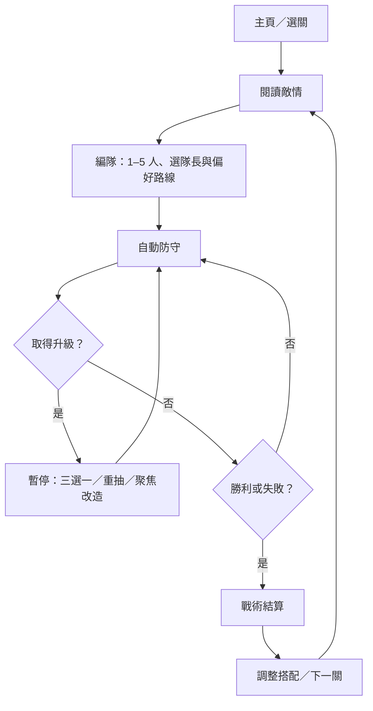
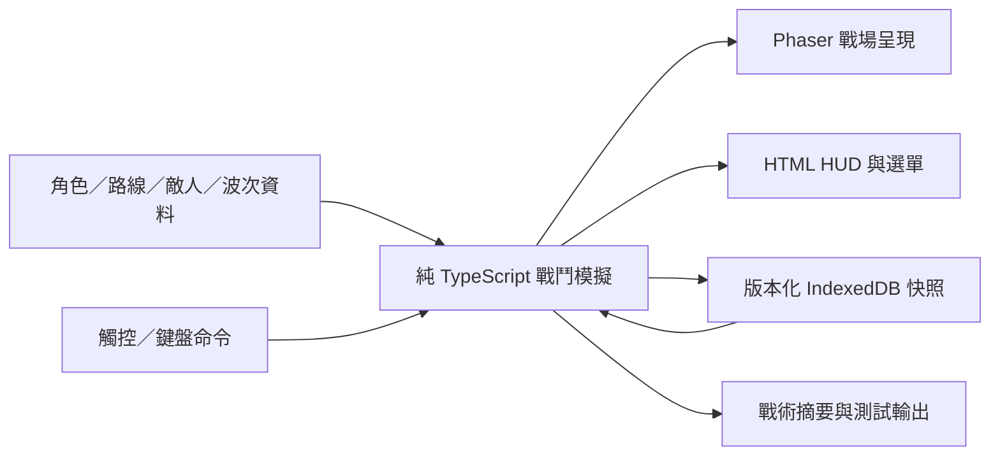

# 《星骸防線：黎明反攻》單人 MVP 規格書

版本：0.1 · 日期：2026-09-04 · 語言：繁體中文 · 專案：SurvivalTowerDefense

**一句話定位：組成最多五人的美少女防衛隊，將回收的外星武器改造成不同流派，在八分鐘內守住地球反攻據點。**

本文件保留訪談確認後的產品、遊戲設計與工程初稿。後續已依授權進入實作；目前數值及抽選邊界修訂以 [DECISIONS.md](DECISIONS.md) 為準，工程結果見 [IMPLEMENTATION_STATUS.md](IMPLEMENTATION_STATUS.md)。下方初稿數值不冒充最新實測結果。

## 0. 決策狀態與閱讀方式

### 0.1 已確認、實作時必須遵守的需求

| ID | 需求 |
| --- | --- |
| R01 | 單人 MVP，手機直向網頁遊戲，電腦瀏覽器可輔助操作與測試。 |
| R02 | 近未來地球遭外星入侵；熱血反攻的日系美少女科幻。 |
| R03 | 六位美少女可自由組隊，每隊最多五位。 |
| R04 | 每人綁定專屬外星改良武器，每把武器兩條局內進化路線，共十二條。 |
| R05 | 六位角色與十二條路線開局全部可用；「可用」代表可在當局構築取得，不代表開場已進化。 |
| R06 | 固定陣地、自動射擊；玩家主要操作三選一升級與手動戰術技能。 |
| R07 | 成功局有效戰鬥時間目標六至八分鐘，選升級時暫停。 |
| R08 | 隨機升級可控，提供免費重抽及進化保底。 |
| R09 | 三個可重玩關卡；以組隊、改造與施放時機取勝，沒有必須農資源的通關門檻。 |
| R10 | 局外解鎖後續關卡、故事與挑戰；不靠反覆升等累積戰力。 |
| R11 | 免登入，進度自動儲存在目前瀏覽器。 |
| R12 | Q 版戰鬥角色搭配精緻日系立繪，以 AI 完成開發。 |
| R13 | 相同基礎戰力下，至少三種不同流派可通關，卡關能透過調整搭配改善。 |
| R14 | 隊長提供唯一手動戰術技能；其餘角色使用自動武器與被動能力。 |

### 0.2 本文件提供的執行初稿

遊戲名稱、角色姓名、年齡、劇情細節、技能名稱、所有數值、波次配置、抽選演算法、技術選型與效能預算，均為依已確認方向提出的第一版設計。AI 可在驗收資料支持下調整這些初稿，但不得藉由加入永久戰力養成、付費解法或強迫刷關滿足驗收。

數值表中的 HP、傷害、機率、時間、通關率和效能數字都是**設計值或待測目標**，不是已測得的成果。調整時記錄版本、原因、前後差異與測試結果。

使用者提供的 HOTDZero 企劃僅作玩法架構參考。本作角色、故事、敵人、美術與名稱採原創設定；原稿中的商業數據、既有遊戲機制描述及平台能力不視為已驗證事實，也不直接沿用其數值。

### 0.3 文件使用順序

1. 先閱讀第 1–4 節，理解玩法及共同戰鬥規則。
2. 依第 5–9 節建立角色、改造、敵人及關卡資料。
3. 依第 10–15 節完成流程、視聽、架構與存檔。
4. 依第 16–18 節的驗收、里程碑和風險處理交付。

## 1. 產品目標與 MVP 邊界

### 1.1 要驗證的問題

玩家是否能理解「這次少帶了哪一種能力、哪些改造能補足缺口、何時施放隊長技能」，並因為想嘗試另一套組合而重玩。

成功體驗是：第一次敗給重甲與後排砲兵，第二次調整隊伍、採用破甲或穿透路線並保留戰術技能，使用相同基礎面板成功通關。

### 1.2 首版交付內容

| 模組 | 首版規模 |
| --- | --- |
| 角色 | 6 位；每位 1 把基礎武器、1 個被動、1 個隊長技能 |
| 武器構築 | 每人 A/B 兩路；每路 I、II、終極進化 E 三個節點 |
| 共用改造 | 6 種，每種最多 2 級 |
| 單局 | 8 個普通波次 + 1 個 Boss 波次；最多 18 次升級選擇 |
| 場景 | 3 關，共用戰場邏輯與尺寸，使用不同背景及敵人組合 |
| 敵人 | 6 種普通敵人、2 種精英變體、3 位 Boss |
| 局外 | 編隊、角色及武器圖鑑、關卡解鎖、故事回看、挑戰標記 |
| 畫面 | 啟動、主頁、編隊、關卡情報、戰鬥、改造、暫停、結算、圖鑑、設定 |
| 音訊 | 1 首主頁循環、1 首戰鬥循環、1 首 Boss 循環、約 16 種音效 |
| 儲存 | 本機進度、偏好設定、編隊、最近一局快照、近期戰鬥摘要 |

### 1.3 本版不包含

多人合作、PvP、公會、帳號、雲端存檔、排行榜、抽卡、商店、廣告、體力、每日任務、裝備掉落、角色稀有度、角色永久升等、基地永久加成、數值服裝、配音、Live2D、3D 模型、程式化無限關卡及完整離線 PWA。

這些功能不預留空白頁或入口。後續是否加入，等 MVP 驗證完成後另立需求。

## 2. 世界觀、角色關係與敘事

### 2.1 故事前提

近未來，名為「群巢」的外星艦群降落地球，將城市改造成採集能源與生物材料的前哨。人類常規武器難以有效阻止它們的裝甲、護盾和集群進攻。

六位成年女性組成「晨星防衛隊」。她們各自來自防衛部隊、研究機構、工程與救援單位，在撤離行動中取得一枚受損的外星「共鳴核心」。透過人類製作的轉譯裝置，隊伍得以回收、改造並使用敵方科技。

敵人留下的戰場資料讓轉譯裝置在一場戰鬥中逐步校準武器，因此形成局內三選一改造。戰鬥結束後，臨時共鳴結構解除；研究知識仍保留在圖鑑中，下一局可自由選擇另一條路線。這是玩法重置的敘事理由，不是消耗材料的經濟系統。

### 2.2 第一章的三次行動

| 關卡 | 防守目標 | 推進故事 |
| --- | --- | --- |
| S01 晨曦撤離線 | 守住城市車站的撤離能源閘門 | 小隊第一次用改良武器抵住群巢，讓市民登上撤離列車。 |
| S02 零點研究所 | 保護正在解碼的轉譯主機 | 發現敵方護盾的共振弱點，取得降落艦核心位置。 |
| S03 墜星反攻 | 守住墜毀降落艦的核心封鎖裝置 | 引出降臨核心、打斷再啟動，完成地球反攻的第一場勝利。 |

### 2.3 敘事份量與語氣

- 每關開場及通關各一段對話，每段 3–5 句，每句原則上不超過 45 個中文字。
- 對話可立即跳過，圖鑑可回看；不占有效戰鬥時間。
- 失敗使用鼓勵調整戰術的台詞，不暗示玩家要充值、升戰力或重複刷素材。
- 角色有爭執、互相吐槽與信任成長；整體保留希望與主動反攻的氣氛。
- 戰鬥威脅以外星結晶、機械甲殼、能量裂解呈現，不以血腥獵奇作為辨識重點。

## 3. 玩家流程與勝負規則

### 3.1 主循環



### 3.2 編隊規則

- 六人全部可見、可選，不可重複；出戰人數為 1–5，零人不能開始。
- 標準關卡以五人小隊平衡；少人出戰屬自選挑戰，不自動降低敵人強度。
- 出戰角色中指定一位隊長。替換隊長離隊時，必須重新指定；預設取編隊第一位。
- 五個站位只影響展示位置；首版不以左右位置產生射程、命中率或敵人攻擊差異。
- 隊伍由六選五產生六種滿編成員組合；更深的差異來自隊長及武器路線，而非宣稱有大量不同的滿編角色組合。
- 戰前標記每人的偏好路線，僅供保底與推薦使用，不消耗資源、不加面板。
- 開戰後不能換角色或隊長；可在升級畫面檢視技能及調整尚未開始的偏好路線。

### 3.3 單局時間及波次

| 項目 | 初稿 |
| --- | --- |
| 普通波次起點 | 0、45、90、135、180、225、270、315 秒 |
| 各波生成窗口 | 波次起點後 0–40 秒，依配置分批產生 |
| Boss 入場 | 第 360 秒；普通波殘敵仍在場 |
| 成功局目標 | 360–480 秒有效戰鬥時間 |
| 最長任務時間 | 480 秒；Boss 與剩餘敵人仍未清除則任務失敗 |
| 暫停時計 | 升級、教學、手動暫停、切到背景、資源錯誤提示均停止遊戲時間 |

不以無敵階段強行拖長戰鬥。較早防線崩潰的失敗局可以短於六分鐘。八分鐘任務期限在關卡情報和戰鬥倒數中明示。

### 3.4 勝負判定

- **勝利**：Boss 已擊敗，全部預定波次已生成完成，所有存活敵人已清除，防線 HP 大於零，時間不晚於 480 秒。
- **防守失敗**：防線 HP 歸零。
- **時間失敗**：480 秒結算點仍未滿足勝利條件。
- 同一模擬步先完成傷害及死亡處理，再判定：防線歸零優先於勝利；仍存活則勝利優先於時間失敗。
- Boss 死亡後停止召喚，但場上殘敵仍須處理；結算期間不再接受技能和升級輸入。
- 失敗不扣資源，按「調整編隊」或「再次挑戰」可立即重試。

### 3.5 初次引導

第一關提供五人推薦隊伍；玩家可更換或跳過引導。引導只解釋防線、自動射擊、第一次改造、隊長技能及重試，不封鎖其他角色或路線。教學暫停不改變抽選結果及敵人狀態。

## 4. 共用戰鬥規則

### 4.1 戰場與單位

- 直向戰場，上方生成外星敵人，下方為防線及小隊。
- 邏輯戰場為 390 × 520 單位；敵人出生 y=20，防線 y=450，小隊展示 y=490；可通行 x=20–370。
- 角色沒有獨立 HP，敵人攻擊共同防線；沒有角色死亡後少打一人的雪球機制。
- 敵人依預排出生位置往下推進，不使用自由尋路、可建造砲塔或動態障礙物。
- 非區域武器可索敵整個可戰鬥區；所有角色從相同邏輯射擊基準點計算命中，立繪站位只改變發射演出。
- 防線初始／最大 HP 均為 1,000，初始護盾為零；各關開始重置，永久進度不能修改此值。

### 4.2 索敵

通用威脅排序依序為：正在蓄力的 Boss、正在蓄力的遠程敵人、接觸防線的敵人、y 座標較大者；平手按生成 ID。特殊武器可使用表中覆寫策略。

每次攻擊重新選合法目標；排除死亡、尚未入場和離場單位。直射彈預設向發射當下位置前進；電弧、狙擊與無人機採立即命中判定配合短演出，避免演出掉幀改變命中。

### 4.3 傷害公式

```text
raw = baseDamage × skillCoefficient × (1 + sum(damageBonuses))
effectiveArmor = clamp(target.armor - armorBreak, 0, 0.70) × (1 - armorIgnore)
hpDamage = raw × (1 - effectiveArmor) × (1 + exposure)
```

- 傷害保留小數計算，僅 UI 顯示時取整。首版不加入暴擊、閃避或隨機傷害浮動。
- `armorBreak` 是減少裝甲率的百分點，`armorIgnore` 是忽略剩餘裝甲的比例，兩者與「彈道穿透幾個目標」不同。
- 曝露 `exposure` 取同時存在的最大值，上限 25%，不將不同來源相乘。
- 護盾先承受 `raw × shieldMultiplier`，不計裝甲與曝露。電弧預設護盾倍率 1.25，其餘為 1；技能可明確覆寫。
- 同一擊打穿護盾時，先用 `shieldHP / shieldMultiplier` 消耗 raw，剩餘 raw 再依 HP 傷害公式處理，不能把護盾加成帶進 HP 傷害。
- 攻速加成先加總：`interval = baseInterval / (1 + attackSpeedBonuses)`；最低間隔 0.10 秒。演算法上限不是省略攻擊次數的理由。
- 隊長技能有獨立基礎值，可受共用傷害與冷卻改造影響，不受角色武器路線的局部加成影響。
- 明確標為「次生傷害」的連鎖、爆炸、燃燒不再次觸發同一來源的命中產物，避免遞迴無限連鎖。

### 4.4 控場、燃燒與護盾

| 效果 | 共通規則 |
| --- | --- |
| 緩速 | 不相加，取最強值；一般敵人上限 60%，Boss 上限 20%。 |
| 暈眩 | 一般敵人依技能秒數；Boss 每次最多 0.25 秒，同一 Boss 受暈後 6 秒內不再被暈。 |
| 擊退／拉扯 | 不把敵人移出戰場；Boss 位移乘 0.25，同一 Boss 每 6 秒最多接受一次位移效果。 |
| 打斷 | 生效的暈眩或擊退可取消尚在蓄力的攻擊；已射出的砲彈繼續飛行。 |
| 燃燒 | 每 0.5 秒結算一次，傷害為 DPS × 0.5；同角色來源只取當前有效效果中的最高 DPS，來源不同可並存。各效果獨立到期，較弱效果刷新不能延長較強效果的到期時間。 |
| 裝甲削弱 | 同類效果取最強值，時間刷新；沒有永久削甲。 |
| 防線護盾 | 上限 300；記錄來源及到期時間，同來源刷新至較大剩餘值，不無限疊加。 |
| 防線受傷 | 先消耗最早到期護盾，再扣 HP；首版沒有防線無敵、滿血加攻或完美通關戰力獎勵。 |

Boss 的短控限制不影響其受傷，所有隊伍都能用傷害處理它；沒有任何敵人完全免疫某一傷害種類。

## 5. 六位美少女與基礎武器

下列年齡及人物設定為原創初稿。全員為成年角色；外觀重點是性格、服裝輪廓和武器差異。

| ID | 角色／年齡 | 個性及隊內角色 | 視覺識別 | 專屬武器／定位 |
| --- | --- | --- | --- | --- |
| C01 | 璃音 Rion／22 | 行動隊長，樂觀、擅長臨場判斷 | 珊瑚紅短外套、白色裝甲、短髮 | 脈衝卡賓槍；穩定輸出、補位 |
| C02 | 雷娜 Rena／24 | 電磁研究員，毒舌但很照顧隊友 | 藍紫長髮、環形導電背架 | 弧鏈發射器；連鎖清怪、破盾 |
| C03 | 凜月 Ritsuki／23 | 前精準射手，冷靜、說話直接 | 白銀髮、深藍長披肩、長槍輪廓 | 質量加速狙擊槍；破甲、優先處理大敵 |
| C04 | 米菈 Mira／21 | 重力工程師，好奇且愛改裝 | 薄荷綠雙髮束、工具腰包、浮環 | 重力投射器；控場、延長輸出時間 |
| C05 | 芙蕾 Flare／25 | 爆破與撤離專家，豪爽可靠 | 橙金色髮、黑橙重裝、肩掛砲管 | 熔核迫擊砲；爆破、燃燒 |
| C06 | 希雅 Sia／24 | 無人機與防護專家，溫和而果斷 | 淡金髮、青白披衣、成對小型無人機 | 棱鏡無人機；曝露標記、臨時防護 |

### 5.1 基礎武器資料

所有範圍半徑均使用戰場邏輯單位。未列出的倍率為 1；無彈藥與換彈系統。

| 角色 | 每擊基礎傷害／間隔 | 基礎行為 | 被動能力 |
| --- | --- | --- | --- |
| C01 | 18 電漿／0.55s | 單發直射，速度 700 | 攻擊具有曝露的目標時，該次武器傷害 +15%。 |
| C02 | 20 電弧／0.90s | 主目標立即命中，再跳至 90 半徑內另一敵人，次目標係數 0.60 | 電弧對護盾倍率 1.25；不與同名通則重複計算。 |
| C03 | 52 動能／1.80s | 最多命中一條線上的 2 人；第二人係數 0.70；優先最大 HP 較高者 | 忽略 35% 剩餘裝甲。 |
| C04 | 24 重力／1.20s | 立即命中後半徑 45 區域傷害，最多 20 目標 | 命中附加 20% 緩速，持續 1.5s。 |
| C05 | 34 熱能／1.50s | 向目標當下位置投射，0.45s 後爆炸，半徑 48，最多 20 目標 | 命中施加 4 DPS 燃燒 3s；燃燒忽略 50% 剩餘裝甲。 |
| C06 | 12 電漿／0.50s | 一架無人機立即命中目標，配短光束演出 | 每 4 次有效主攻擊命中，對該目標施加 10% 曝露，持續 4s。 |

範圍效果超過目標上限時，先按距離中心由近至遠，再按生成 ID 選取。每次主攻擊只增加一次被動計數，不能靠穿透、連鎖和持續傷害重複計數。

### 5.2 隊長戰術技能

開局已就緒，施放後進入冷卻。只有隊長的技能按鈕出現在戰鬥 HUD；冷卻只隨有效戰鬥時間推進。所有技能都無需拖曳瞄準。

| 隊長 | 技能 | 初稿效果 | 冷卻 |
| --- | --- | --- | --- |
| C01 | 天際掃射 | 鎖定威脅最高敵人的當前位置，半徑 90，連續 4 次各 35 電漿傷害，間隔 0.2s，每次最多 20 目標。 | 45s |
| C02 | 電磁靜默 | 所有敵人受到 60 電弧傷害及 1.5s 暈眩；仍套用 Boss 控場上限；範圍為全戰場。 | 50s |
| C03 | 核心貫擊 | 最大 HP 最高的敵人受到 420 動能傷害，該擊忽略全部裝甲；不穿透其他目標。 | 45s |
| C04 | 時差力場 | 全體敵人受到 50% 緩速 5s，並立即向上擊退 60；Boss 依限制折減。 | 50s |
| C05 | 熔星空投 | 威脅最高位置半徑 100，造成 160 熱能傷害，附加 12 DPS 燃燒 5s，最多 20 目標。 | 50s |
| C06 | 棱鏡防幕 | 為防線提供 220 點護盾，持續 8s；不回復 HP。 | 50s |

無目標的攻擊／控場技能不能施放，也不消耗冷卻；C06 的防護技能可在沒有敵人時施放。技能輸入同一模擬步最多接受一次。

## 6. 十二條武器進化路線

### 6.1 路線共同規則

- 每路固定 `I → II → E`，各消耗一次升級選擇。
- 取得某角色的 A-I 或 B-I 即鎖定該角色本局路線；另一條本局不再出現。重開一局即可改選。
- 單局最多三把武器取得 E；其餘出戰武器仍可到 II。UI 持續顯示「終極進化 0/3」。
- E 先替換該武器的基礎行為，再套用已取得的 I、II、通用改造。表中 E 倍率以未改造基礎數值為基準，不能重複套倍率。
- 改造自下一次攻擊生效；既有彈體、場域及狀態保留建立時參數，直到原定到期。攻擊間隔改變時，按新／舊間隔比例縮放剩餘攻擊等待時間。
- 進化不能要求未出戰角色、圖鑑進度、裝備、材料或前一局勝利。
- 每張路線卡顯示當前／下一節點、實際前後效果、取捨與進化名額需求。

### 6.2 完整路線表

| 路線 ID／名稱 | I | II | E：行為變化與代價 |
| --- | --- | --- | --- |
| C01-A 蜂巢脈衝 | 武器傷害 +15% | 攻速 +15% | 每次向最多 3 個不同目標各射 1 發，單發係數 0.65；少於 3 人時最多 1 發命中同一人。強於清怪，單體每輪較弱。 |
| C01-B 破盾日冕 | 武器傷害 +20% | 對護盾倍率改為 1.50 | 單發傷害 ×1.80、基礎間隔 ×1.25；直線最多命中 3 人，後續每人係數 0.80；對護盾倍率改為 2.00。以射速換穿透及破盾。 |
| C02-A 連鎖天幕 | 跳躍距離 +20% | 次生電弧係數由 0.60 改為 0.75 | 最多跳 4 次、每次傷害為前一跳的 0.75；不重複命中同一敵人。敵人分散或只剩 Boss 時收益減少。 |
| C02-B 磁暴囚籠 | 主目標傷害 +20% | 主攻速 +15% | 停止基礎跳躍；同目標每承受 3 次主攻擊，引爆半徑 70 的 70 電弧傷害及 1s 暈眩，最多 20 人。引爆不產生新充能。 |
| C03-A 星穿長槍 | 武器傷害 +15% | 攻速 +12% | 直線最多命中 6 人；依序係數 1.00、0.90、0.80、0.70、0.60、0.50，保留 35% 忽略裝甲。依賴敵人排列。 |
| C03-B 事件視界 | 對精英及 Boss 武器傷害 +20% | 武器傷害 +15% | 單體傷害 ×2.20、基礎間隔 ×1.40，取消穿透；保留 35% 忽略裝甲。強化大敵處理，清群能力降低。 |
| C04-A 引力漩渦 | 區域半徑 +15% | 控場持續時間 +20% | 改為每 4s 在威脅最高位置建立半徑 85、持續 3s 的場，每秒基礎傷害 14，緩速 30%、拉向中心速度 18/s；最多同時 1 場、20 目標。犧牲直接射擊。 |
| C04-B 重力反轉 | 武器傷害 +15% | 攻速 +15% | 保留基礎彈，每 5 次主攻擊再把當次命中區域敵人向上推 70；Boss 受位移限制。控制是間歇式，必須有其他輸出補足。 |
| C05-A 赤潮燃燒 | 燃燒傷害 +25% | 區域半徑 +15% | 爆炸基礎傷害 ×0.80；留下半徑 70、持續 4s 的火區，每 0.5s 對區內敵人施加／刷新 8 DPS、持續 1s 的燃燒。同來源火區不疊傷，最多同時 2 區。 |
| C05-B 超新星彈 | 爆炸傷害 +20% | 區域半徑 +15% | 爆炸基礎傷害 ×2.20、半徑 ×1.40、基礎間隔 ×1.60，取消武器燃燒。適合一次處理密集群怪，較慢且無持續傷害。 |
| C06-A 蜂群校準 | 武器傷害 +15% | 曝露持續時間 +2s | 改為 2 架無人機，各自傷害 ×0.65，攻擊間隔不變；每架各自計數，曝露強度改為 20%。不能疊成 40%。 |
| C06-B 棱鏡壁壘 | 武器傷害 +15% | 攻速 +15% | 保留單機，武器基礎傷害 ×1.30；每 15s 提供 100 防線護盾 6s，同來源刷新而非相加。不能回復 HP，失去 A 路強曝露支援。 |

補充：C04-A 的每秒傷害受武器／共用傷害加成影響，建場間隔受攻速加成影響；R1 半徑與 R2 控場時間正常生效，R2 不延長傷害場壽命。C05-A 舊火區超過上限時移除最早建立者；進化保留原有燃燒被動，對同一人仍依最高 DPS 刷新規則處理，不把被動與火區加算。

### 6.3 通用改造

| ID | 名稱 | 每級效果 | 上限／合法條件 |
| --- | --- | --- | --- |
| G01 | 共鳴增幅 | 全隊武器及隊長技能傷害 +8% | 2 級 |
| G02 | 加速迴路 | 全隊武器攻速 +6% | 2 級 |
| G03 | 廣域透鏡 | 武器及隊長技能的有限區域半徑 +10% | 2 級；至少一個已擁有技能具有區域半徑 |
| G04 | 快速同步 | 隊長技能基礎冷卻 -6% | 2 級；取得時依新／舊總冷卻比例縮放剩餘時間 |
| G05 | 緊急補強 | 防線最大 HP +100，當前 HP 同時 +100 | 2 級；僅本局生效 |
| G06 | 狀態延展 | 全隊施加的緩速、暈眩、曝露與燃燒持續時間 +10% | 2 級；至少具備其中一種狀態；仍遵守 Boss 硬上限 |

共用改造屬局內構築，回到新的一局即清除。G03 不增加無限／全戰場效果，也不增加跳躍距離；G06 不延長防線護盾、地面場域和位移距離。

## 7. 經驗、三選一與保底演算法

### 7.1 共用經驗

- 全隊共用一條經驗，不按最後擊殺者分配，不需手動撿取。
- 每個普通波次固定提供 90 XP。若該波有 N 名預定敵人，先每人分配 `floor(90/N)`，餘數依生成序號逐一加 1。
- XP 在對應敵人死亡時立即發放；同一敵人只結算一次，復原快照不能重複領取。
- 每 40 XP 取得一次選擇，保留餘數；8 × 90 = 720 XP，完整擊殺可取得 18 次選擇。
- Boss、召喚物與因機制生成的額外敵人均為 0 XP，避免刻意拖時間農升級。
- 單局第 18 次選擇後顯示「改造完成」，不再排入升級事件。
- 一次跨多級時，依序處理所有待選次數；全部完成前維持暫停，不能漏掉或重複處理。

### 7.2 合法候選池

1. 只收錄出戰角色能取得的下一節點與仍合法的通用改造。
2. 未選路線者可出現 A-I 或 B-I；已選者只出現該路下一節點。
3. E 需已有 II，且全隊已進化數少於當局上限（標準 3、限進化挑戰 2）；未滿足時不是低機率，而是不進入池。
4. 卡片 ID 在同一組三選一中不可重複；同角色 A-I 與 B-I 是不同 ID，可同時出現。
5. 通用卡每張權重 1，路線 I/II 每張權重 2；E 走保底，不依賴一般隨機權重。
6. 抽取無放回，候選先按 ID 排序，再使用單局的改造亂數串流抽取。

### 7.3 兩層保底

**進化保底：**某角色取得 II 後，在下一次及之後每次升級，保證三選一中至少出現一張已就緒的 E，直到玩家選取或進化名額用完。多張 E 按就緒時間排序，平手依角色 ID；玩家也可在該格切換到其他已就緒 E，不能被第一張長期擋住。

**聚焦改造：**第 1、4、7、10、13、16 次升級，其中一格為聚焦卡。玩家可指定出戰角色，該格保證提供其偏好路線的下一個合法節點。未開始路線時可在 A/B 中指定；路線鎖定後只提供當局路線。

聚焦卡也占一次三選一，沒有額外免費升級。它讓玩家能保證取得三位主力各兩個前置節點，再透過 E 保底完成三把進化；前提是玩家把相應選擇投入這些角色。

同時有 E 保底與聚焦卡時，先放 E 格，再放聚焦格；若兩者為同一卡，只保留一份，空格以隨機候選填滿。聚焦目標切換只改變該格，其他隨機格不得跟著刷新。

所選聚焦角色沒有合法下一節點時，提示改選其他角色；所有角色都沒有合法下一節點時，聚焦格改由一般合法候選填入。名額用完的 E 不進入保底隊列，也不能從切換選單取得。

### 7.4 重抽與候選不足

- 每局 3 次免費重抽，整局共用、不付費補充。
- 重抽只重抽一般隨機格；保底格維持功能與候選，已鎖定的 E 選擇不被洗掉。
- 有替代候選時，優先排除重抽前同一格卡片；不存在替代者時該格保留。
- 如果所有隨機格均無可變內容，禁用重抽且不扣次數。
- 合法候選只有 1–2 張時只顯示實際張數，不以重複卡填滿；為空時提供「完成本次校準」，消耗該次選擇但不改變數值。
- 對 1–5 人、路線滿級、名額耗盡等狀態都必須能前進，不能卡在無法關閉的升級畫面。
- 同一 seed、相同行為記錄及同一內容版本，候選與波次須可重現；刷新頁面不免費改牌。

### 7.5 玩家能看見的資訊

升級畫面顯示角色名稱、改造節點、效果變化、適合對付的敵人、路線鎖定提示、進化名額及剩餘重抽次數。聚焦卡標為「可指定改造」，E 標為「前置已達成」，不使用假稀有度和暗示付費的色框。

## 8. 外星敵人與 Boss

### 8.1 普通敵人與精英

速度單位為邏輯單位／秒，裝甲為 0–1 的減傷率。HP 是 S01 基準，後續關卡倍率見第 9 節。沒有飛行／地面兩套傷害判定，外觀懸浮的單位仍可受所有武器影響。

| ID／短碼 | 名稱 | HP／護盾／裝甲 | 速度 | 攻擊及機制 | 可用對策 |
| --- | --- | --- | --- | --- | --- |
| E01／C | 裂殼爬行者 | 140／0／0 | 16 | 到防線後每 1s 造成 8 傷害 | 連鎖、散射、範圍爆炸 |
| E02／R | 迅刃獵犬 | 90／0／0 | 35 | 到防線後每 1s 造成 14 傷害 | 緩速、擊退、快速直射 |
| E03／P | 鐵脊重裝體 | 460／0／0.55 | 10 | 到防線後每 1.2s 造成 22 傷害 | 忽略裝甲、燃燒、集中單體傷害 |
| E04／S | 棱盾哨兵 | 220／300／0.10 | 12 | 護盾不自動回復；到防線後每 1.2s 造成 16 傷害 | 電弧、破盾武器、持續火力 |
| E05／A | 孢子砲手 | 140／0／0 | 10 | 到 y=250 停下；每 8s 蓄力 1.5s，射出傷害 35、速度 160 的防線砲彈 | 蓄力時打斷、穿透後排、範圍爆炸、護盾承接 |
| E06／M | 縫合工蜂 | 190／0／0.10 | 12 | 每 8s 為距離 100 內受損最重的非 Boss 友軍恢復其最大 HP 的 5%；不能復活；接觸傷害 8/1s | 範圍清除、穿透；治療不產生額外 XP |
| E07／H | 精英鐵脊 | 1,000／0／0.55 | 10 | 首次 HP 低於等於 50% 時獲得 300 護盾；接觸傷害 35/1.2s | 預留破盾或單體技能，沒有無敵時間 |
| E08／D | 精英迅刃 | 400／0／0.10 | 28 | 首次 HP 低於等於 50% 時蓄力 1.2s，再以 2 倍速度衝刺 2s；接觸傷害 30/1s | 觀察蓄力、打斷或控場；被打斷後本次衝刺不重試 |

第一發接觸攻擊在抵達防線 0.3s 後發生。移開防線後取消待發接觸攻擊，重新接觸再次等待 0.3s。砲手和工蜂的技能初始冷卻為表列完整時間，避免入場即造成無預警傷害。

### 8.2 Boss 初稿

Boss 於第 360 秒出現在 x=195、y=150，以固定位置執行行為循環；位移效果結束後不瞬間傳回原位，而以 8/s 回到錨點。它們的攻擊直接威脅防線，不能靠永久推遠消除壓力。

| ID／關卡 | Boss | 初始資料 | 行為及反制 |
| --- | --- | --- | --- |
| B01／S01 | 群巢播種者 | HP 6,500；裝甲 0.10 | 每 18s 召喚 6 隻 E01；每 14s 蓄力 2s 後對防線造成 70 傷害。用範圍火力清召喚物，用控場取消蓄力，或集中火力提早結束。 |
| B02／S02 | 棱盾監工 | HP 10,000；護盾 1,800；裝甲 0.25 | 每 20s 補充 600 護盾，上限 1,800；每 12s 蓄力 2s 後連射 3 發、每發 25 防線傷害、間隔 0.3s。護盾從正值降至零時，立即取消正在蓄力的攻擊並曝露 25% 共 6s。 |
| B03／S03 | 降臨核心 | HP 13,000；裝甲 0.20 | 每 18s 循環：待機 5s → 蓄力 3s → 對防線造成 120 傷害 → 曝露 25% 共 6s → 待機 4s。每 24s 交替召喚 4 隻 E02／2 隻 E03；首次 HP ≤50% 獲得 1,500 護盾。 |

Boss 的冷卻以入場時為零點，第一個動作依完整冷卻／循環時間發生。B03 若蓄力被打斷，該次傷害取消，但仍進入原定的 6s 曝露階段；不重置整輪循環以逃避反制。

Boss 召喚物 HP 使用本關普通敵人倍率，XP 為零。所有 Boss 蓄力都同時有圖示、文字及地面／核心動畫，不能只靠顏色或聲音辨識。

## 9. 三關配置與流派驗證

### 9.1 關卡情報

| 關卡 | 主題 | 普通／精英 HP 及護盾倍率 | 裝甲／速度倍率 | 玩家要讀懂的問題 |
| --- | --- | --- | --- | --- |
| S01 晨曦撤離線 | 城市車站、晨光、臨時防護門 | 1.00 | 維持敵人基礎值 | 能否兼顧群怪與少量快速／重裝威脅？ |
| S02 零點研究所 | 冷色實驗室、護盾設施 | 1.10 | 維持敵人基礎值 | 能否處理裝甲、護盾及藏在後排的砲手？ |
| S03 墜星反攻 | 外星降落艦殘骸、夕陽反攻 | 1.20 | 維持敵人基礎值 | 能否分配進化名額，同時處理混合敵群及 Boss 窗口？ |

上述倍率不套用 Boss；Boss 使用自身表列資料。關卡難度主要增加敵人組合與機制，玩家的初始戰力完全相同。

### 9.2 八個普通波次的確切配方

短碼對應第 8 節，例如 `C24 R6` 代表 24 隻爬行者與 6 隻獵犬；不是隨機權重。精英數量已包含在配方內，不額外扣減或替換其他敵人。

| 波次／開始秒數 | S01 | S02 | S03 |
| --- | --- | --- | --- |
| W1／0 | C24 | C20 P4 S2 | C22 R6 P4 |
| W2／45 | C22 R6 | C18 R8 S4 | C20 R8 S4 A2 |
| W3／90 | C22 P4 | C18 P6 A2 | C20 P6 S4 M2 |
| W4／135 | C22 R8 A2 | C20 S6 M2 A2 | C20 R10 A4 D1 |
| W5／180 | C22 P6 A2 | C20 P6 A4 M2 | C22 P8 S4 A4 |
| W6／225 | C22 R10 A3 | C20 R10 S4 D1 | C22 R10 S6 M3 |
| W7／270 | C24 P6 R8 | C20 P8 S4 A4 H1 | C24 P8 A4 M2 H1 |
| W8／315 | C24 P8 A4 | C22 P6 R8 S4 A4 | C24 R10 P8 S4 A4 M2 H1 D1 |

**生成規則：**每波按配置展開完整敵人清單，用波次亂數串流打亂；每 5s 生成一組，在 0、5、10、15、20、25、30、35 秒分成 8 組，數量差至多 1。x 從 45、120、195、270、345 五條生成帶中抽選，偏移為 -8 至 +8；各帶不是角色專屬防守路線。

精英生成時間固定安排在該波第 20 秒組：以交換該組普通敵人的方式調整位置，維持每組數量，仍計入該波總數與 90 XP 配額。多隻精英按 ID 排序。完成排序後才按最終生成序號分配 XP。所有生成清單在開局依 seed 決定，不根據玩家即時表現偷偷改難度。

### 9.3 三套必要驗收構築

這些是待測的設計假說，需以實際結果調整數值；不能直接把它們標示為已平衡的攻略。

| 流派 | 五人隊伍／隊長 | 三把核心進化 | 主要優勢與缺口 |
| --- | --- | --- | --- |
| T01 連鎖清場 | C01、C02、C04、C05、C06；隊長 C02 | C02-A、C01-A、C05-A | 清群與控場強；放棄 C03 的穩定破甲，需靠燃燒及保留技能處理大敵。 |
| T02 核心狙殺 | C01、C02、C03、C04、C06；隊長 C03 | C01-B、C03-B、C06-A | 破盾、單體爆發及曝露配合；缺乏 C05，群怪壓力依賴其他人的基礎範圍與控場。 |
| T03 控場灼燒 | C02、C03、C04、C05、C06；隊長 C04 | C04-A、C05-A、C06-B | 延長火區輸出時間，用護盾緩衝；沒有 C01，Boss 爆發較弱，需要把握曝露窗口。 |

每套測試都須在三條核心路線之外，自行分配剩餘選擇。不得使用開發作弊、永久加成或只挑有利 seed 才聲稱通關。

### 9.4 重試與回饋

結算顯示：防線剩餘 HP、有效時間、隊伍、隊長、已選改造、完成進化、各角色傷害、護盾吸收量、控場有效時間，以及造成防線傷害最多的敵人類型。

失敗提示根據數據選擇至多兩條，例如「砲手造成 42% 防線傷害，可嘗試穿透或保留打斷技能」。傷害百分比來自該局事件，不使用寫死的虛構統計。推薦說明作用原理，不聲稱某一角色是唯一解答。

「再次挑戰」預設使用相同 seed 與隊伍，讓玩家比較改法；另提供「新戰局」取得新 seed，以及「調整編隊」保留該 seed 返回編隊。seed 本身只放在詳細資訊／測試輸出，不占主要遊戲介面。

## 10. 局外解鎖與不農的約束

### 10.1 解鎖流程

- 新存檔：六位角色、十二條路線、完整武器說明、S01、推薦隊伍均可使用。
- 首次通過 S01：解鎖 S02、S01 故事回看與挑戰標記。
- 首次通過 S02：解鎖 S03、S02 故事回看與挑戰標記。
- 首次通過 S03：解鎖第一章結尾及 S03 挑戰標記。
- 重複通關只更新個人最佳紀錄與構築摘要，不產出戰力資源。
- 圖鑑的敵人資料可隨首次遭遇點亮；關卡情報始終提前公開敵人類型與機制，不能因圖鑑未解鎖隱藏必要反制資訊。

### 10.2 挑戰標記

每關首次通關後，可主動挑戰「最多四人」「不使用隊長技能」「最多兩把終極進化」。每次至多選一項；它們只限制當局選項，不改變敵人數值。獎勵是該關的完成標記和紀錄，不提供傷害或防禦加成。

### 10.3 防止農度回流的設計檢查

任何新增系統都應回答：失敗的玩家能否不先重複打已通關內容，就立即採用新的搭配重試。如果不能，該系統不符合本版目的。

不得用角色等級、累積登入、重複掉落、進化碎片、帳號攻擊加成或通關後永久加血修補平衡。可調整的項目為敵人構成、各路線效用、初始共通面板、選擇預算與明確的機制提示。

## 11. 介面與手機操作

### 11.1 畫面清單

| 畫面 | 必要內容與主要操作 |
| --- | --- |
| 啟動／載入 | 遊戲標誌、載入進度、資源錯誤重試；有進行中快照時提供繼續／放棄本局 |
| 主頁 | 目前關卡、開始行動、編隊、圖鑑、設定；顯示本機儲存狀態 |
| 關卡情報 | 敵人類型、主要機制、Boss 簡介、八分鐘期限、挑戰條件 |
| 編隊 | 六張角色卡、五個出戰位、隊長選擇、各角色偏好路線、推薦隊伍與開始 |
| 角色／武器圖鑑 | 立繪、性格簡介、基礎武器、被動、隊長技能、兩條完整路線與取捨 |
| 戰鬥 | 防線 HP／護盾、波次、任務時間、經驗、五人狀態、唯一戰術技能、暫停 |
| 升級 | 三張卡、重抽、聚焦選擇、E 保底切換、目前路線及進化名額 |
| 暫停 | 繼續、查看構築、音效設定、返回主頁並保留快照、放棄本局 |
| 結算 | 勝負、原因與戰術摘要、再次挑戰、調整編隊、已解鎖的下一關 |
| 設定 | 音樂／音效、減少特效／震動、存檔狀態、重置本機進度 |

### 11.2 戰鬥版面

設計參考畫布為 390 × 844 CSS 像素；實際採自適應佈局，不把所有文字與按鈕一起縮小成固定圖片。

```text
┌─────────────────────────┐
│ 防線 HP／護盾    波次  暫停 │
│ 任務倒數        共用經驗   │
├─────────────────────────┤
│       外星敵人生成區       │
│                         │
│     戰場、攻擊與蓄力預警    │
│                         │
│ ═══════防線════════      │
│   Q版小隊：最多五位        │
├─────────────────────────┤
│ 五人武器路線／進化狀態      │
│        隊長戰術技能        │
└─────────────────────────┘
```

- 支援 360 × 640、390 × 844、430 × 932 的直向 CSS 視窗作為首輪驗收尺寸。
- 戰場 Canvas 使用等比 FIT 放入剩餘區域；邏輯尺寸與敵人數值不隨裝置改變。
- 觸控按鈕有效區至少 44 × 44 CSS 像素；隊長技能至少 64 × 64；正文建議 16px、輔助文字不低於 13px。
- 使用安全區及動態視窗高度，避免瀏覽器工具列遮住技能和選卡按鈕。
- 三選一使用直向堆疊卡片，長說明在暫停狀態可捲動；不依賴 hover 或長按閱讀關鍵資訊。
- 主選卡操作先點卡片再按單一「套用改造」，可在確認前換選；避免手指誤觸不可逆路線。
- 電腦以滑鼠操作；Space 施放隊長技能、Esc 暫停。輸入框／對話聚焦時不攔截按鍵。
- 手機轉橫向時自動暫停並提示轉回直向；桌面維持置中的直向遊戲區，兩側留白。
- 不加入手動瞄準、拖曳角色、放置砲塔或多個技能快捷列。

### 11.3 新手資訊密度

戰前先展示「清群、對甲、對盾、控場、支援」能力概況，點開才展開精確數字。戰鬥時顯示當前效果；完整公式、測試 seed 和傷害事件在圖鑑詳細資訊或開發工具中查閱。

能力概況由資料標籤推算，用於提示缺口，不顯示虛構的綜合戰力分數。推薦隊伍可一鍵套用，但不能把其他選法標成不可玩。

## 12. 美術、動畫與音訊

### 12.1 視覺方向

日系動畫風、清楚線條、角色色彩鮮明。人類設備採白色／深藍硬表面與可辨識的握把、扳機、護具；外星部件採半透明晶核、懸浮環與異形散熱結構，讓玩家一眼看出「人類改良的外星科技」。

角色頁使用精緻立繪；戰鬥角色約三頭身、武器輪廓明確。敵人採機械與生物甲殼混合設計，透過形狀區分速度、護盾和裝甲。UI 使用深藍底、白色文字，青色表示己方科技、橙紅表示危險；警示同時有圖示與文字。

### 12.2 必要素材表

| 資產 | 數量／建議來源尺寸 | 實作要求 |
| --- | --- | --- |
| 角色立繪 | 6 張，約 1,024 × 1,536 | 每人先一張完整立繪；頭像從同一張裁切，維持一致性 |
| Q 版角色 | 6 組，約 384 × 384 的基礎素材 | 身體及武器可分層；固定陣地以呼吸、後座、槍口特效表達動作 |
| 專屬武器圖示 | 6 張，256 × 256 | 可從核准的武器設計裁切或另製圖示 |
| 終極進化圖示 | 12 張，256 × 256 | 明確表現多彈、穿透、連鎖、重力、燃燒、護盾等差異 |
| 普通敵人 | 6 組，約 256 × 256 | 可用分層位移／縮放及受擊閃色；不要求大量逐格動畫 |
| 精英敵人 | 2 組 | 基於對應普通敵人加外甲、發光核心與輪廓變化，不只換色 |
| Boss | 3 組，約 512 × 512 | 分離核心與外殼，支援蓄力、破盾、曝露、死亡狀態 |
| 關卡背景 | 3 張，約 780 × 1,040 | 共用防線座標及可讀戰場；細節集中在側邊與背景 |
| 效果素材 | 1 組共用圖集 | 光點、弧線、衝擊環、火區、力場、護盾、命中、死亡碎片 |

角色和敵人動畫採小幅分層變形與 2D Tween 即可；MVP 不要求六套完整骨架或大量逐格動作。終極進化至少同時改變彈道／場域形狀、色彩或聲音其中兩項，不能只改數字。

### 12.3 AI 素材製作與整合要求

1. 先建立六人的髮型、配色、服裝輪廓、武器及比例設定，再製作立繪與 Q 版，避免各張圖互不一致。
2. 每項資產記錄 ID、用途、生成描述、尺寸、檔案、來源工具及可追溯的使用資訊。
3. 驗收透明邊緣、人物手部、武器方向、小尺寸可讀性與與角色設定的一致性。
4. 遊戲文字、數值與按鈕以 HTML／程式繪製；不把 AI 生成圖片內的文字當正式 UI。
5. 工程初期可用清楚的替代圖驗證；最終 MVP 交付必須具有六位可辨識角色、三種場景與完整敵人識別，不能把替代圖版宣稱為美術完成。
6. 若生成工具或素材來源不可用，先完成可測的工程階段，列出具體缺件；不得捏造已產出的素材。

### 12.4 音訊與回饋

- 音樂使用熱血電子搖滾；Boss 段提高節奏，首次有效操作後才啟動音訊。
- 基礎音效至少包含六種武器識別、命中、破甲／破盾、敵人死亡、升級、進化、技能就緒、技能施放、警報、勝利及失敗；可共用分層音效控制總量。
- 同時播放的音效限制為 16 聲道，同類短音效在 50ms 內合併；警報優先於連續射擊聲。
- 切到背景暫停遊戲與音訊，回來後由玩家點擊繼續；瀏覽器要求重新啟用音訊時仍能無聲遊玩。
- 提供減少震動、降低特效及獨立音量；護盾、蓄力和受擊資訊在靜音時仍完整可辨識。

## 13. 技術架構與運行規格

### 13.1 技術選型初稿

| 層 | 選型 | 原因與限制 |
| --- | --- | --- |
| 語言 | TypeScript，開啟 strict | 用型別維護角色、技能、存檔和事件契約 |
| 開發／建置 | Vite，採 vanilla-ts 結構 | 專注單頁遊戲及靜態發佈；不引入額外應用框架 |
| 2D 呈現 | Phaser 3.90.0，鎖定確切版本 | 本版使用成熟的 3.x API；不把 3.x 與目前預設文件中的其他主版本混用 |
| 戰鬥模擬 | 獨立的純 TypeScript 模組 | 不依賴 Phaser 物件、DOM、真實時間或視覺動畫，可以無畫面重播與測試 |
| HUD／選單 | HTML + CSS，Canvas 只負責戰場 | 支援手機排版、可讀文字、觸控與鍵盤操作 |
| 儲存 | IndexedDB | 儲存結構化進度、快照及版本資料，使用交易保持一致性 |
| 驗證 | TypeScript 檢查、Vitest、Playwright | 分別處理型別、規則／模擬、使用者流程；真機另驗證 |
| 發佈形態 | 靜態 `dist/`，一般 HTTPS 靜態站點 | MVP 無應用伺服器、登入服務或資料庫後端；本次不進行部署 |

Phaser 3.90.0 是可取得的固定版本，此選擇不是「最新版本」主張。[Phaser 3.90.0 官方發布頁](https://phaser.io/news/2025/05/phaser-v390-released)

戰場採 FIT 等比縮放並明確指定父容器尺寸；相關 API 以鎖定版本為準。[Phaser 3.90.0 ScaleManager](https://docs.phaser.io/api-documentation/3.90.0/class/scale-scalemanager)

文件建立時，本機 Node 為 22.22.3、npm 為 10.9.8，專案目錄尚無既有程式。實作初始化時選取與 Node 相容的 Vite、TypeScript、Vitest、Playwright 版本，寫入 lockfile；目前 Vite 指南列出 Node 20.19+／22.12+ 的基礎要求，個別模板仍可能有其他限制。[Vite 官方指南](https://vite.dev/guide/)

### 13.2 模組分工



建議目錄是後續實作藍圖，本次不建立空程式檔：

```text
src/
  app/          啟動、頁面流程、資源與設定
  data/         characters、weapons、routes、upgrades、enemies、stages
  sim/          state、step、commands、combat、draft、rng、systems
  game/         Phaser 場景、渲染適配、音訊與物件池
  ui/           HUD、編隊、選卡、圖鑑、結算
  storage/      schema、repository、migration、snapshot
  diagnostics/  戰術報表、重播、開發資訊
public/assets/  圖片、圖集、音訊及資產清單
tests/
  rules/        傷害、保底、狀態及資料驗證
  simulation/   固定 seed 與構築測試
  e2e/          主要操作及存檔流程
docs/
  MVP_SPEC.md   本規格
```

### 13.3 模擬時計與步進

- 固定 30 Hz 模擬，畫面以 requestAnimationFrame 插值呈現；遊戲結果不依賴螢幕更新率。
- 所有持續時間初始化為整數 tick，使用一致的向上取整規則；UI 秒數只是顯示值。
- 每個 tick 依序：處理命令 → 產生敵人 → 更新效果／移動 → 索敵與攻擊 → 彈道／區域命中 → 扣血與死亡 → 收集 XP → 判定終局 → 若未終局則排入升級。
- 同 tick 已判定防線崩潰時，不允許玩家用新拿到的補強卡復活。
- `pauseReasons` 使用集合，至少區分 user、upgrade、tutorial、hidden、orientation、error。移除其中一個原因不能清掉其他暫停原因。
- 背景時間不補算；回前景不追趕離線傷害，也不自動施放技能。
- 每幀最多處理 5 個累積 tick；主執行緒停頓超過 0.5s 時暫停並讓玩家恢復，避免一次跳過重要預警。若頻繁發生即視為效能不合格，不以暫停掩飾。
- 改造 RNG、波次 RNG、純視覺 RNG 分開；粒子數和低特效設定不能改變候選牌、敵人生成或傷害。
- 不讓 Phaser Tween、音效結束事件或動畫完成回呼直接決定傷害與勝負。

### 13.4 效能與載入預算

以下是工程門檻，需在實機記錄，尚未測得。

| 項目 | 初版目標 |
| --- | --- |
| 手機 | 以 60 FPS 呈現為目標；高密度時 30 FPS 仍可操作；最重 60s 區間的 P95 frame time ≤33.3ms |
| 邏輯 | 固定 30 Hz，手機／桌面相同；降特效不改變模擬結果 |
| 壓測情境 | 同場 120 敵人、400 個可見彈體、12 個場域及技能效果；需另涵蓋 Boss 召喚及三把進化同時觸發 |
| 首屏必要下載 | gzip／Brotli 後合計 ≤4 MiB，包含首屏素材 |
| 首戰必要下載 | 從空快取起算合計 ≤8 MiB；其餘立繪與音樂按需載入 |
| 全部素材 | 傳輸量目標 ≤20 MiB；超標需提供拆分載入方案 |
| 載入時間 | 10 Mbps、100ms RTT 的測試設定下，首屏可操作 ≤5s，首次進戰 ≤10s |
| 紋理 | 單張圖集不大於 2,048 × 2,048；同時駐留的解碼紋理目標 ≤128 MiB |
| 穩定性 | 連續完成 5 局及往返選單，無崩潰、重複監聽器、持續增加的計時器或不可回收資源 |

容量預算不是刪除邏輯物件的理由；不能因畫面敵人太多就略過傷害或生成。先降低裝飾粒子與飄字、共用材質、使用空間索引及物件池；正式波次須通過壓測。無法達標時優先改特效與生成配置，記錄其玩法影響。

### 13.5 瀏覽器與中斷行為

- 核心驗收涵蓋 iOS Safari、Android Chrome、桌面 Chrome 及 Safari；記錄實測裝置、OS 與瀏覽器版本，不以「所有手機」描述支援。
- 切背景以 Page Visibility 事件進入暫停，立即嘗試保存；返回顯示「繼續戰鬥」。瀏覽器對背景頁面可能節流，不能以背景 setTimeout 維持戰鬥。[MDN Page Visibility API](https://developer.mozilla.org/en-US/docs/Web/API/Page_Visibility_API)
- 本局必要資源進場前完成載入；中途失去網路仍可繼續已載入的戰鬥。未實作 Service Worker，因此不承諾斷網後重新開啟網站可用。
- WebGL 無法建立或 context lost 時暫停並提供恢復／重新載入，不靜默顯示黑畫面。Phaser 的 Canvas 備援可在實作時評估，未驗證前不列為已支援模式。
- Playwright 使用 Chromium／WebKit 做自動流程驗證；其 WebKit 不能代替實際 iPhone Safari 的完整驗收。[Playwright 瀏覽器文件](https://playwright.dev/docs/browsers)

## 14. 資料契約與事件

本節為型別及資料需求，不是已存在的程式 API。實作可拆檔，但 ID、單位及行為須維持一致。

### 14.1 靜態定義

| 定義 | 必要欄位 |
| --- | --- |
| CharacterDef | id、name、age、roleTags、weaponId、passiveId、tacticalId、portraitKey、spriteKey |
| WeaponDef | id、ownerId、damageType、baseDamage、baseIntervalTicks、behavior、targetPolicy、parameters |
| RouteDef | id、ownerId、branch、name、nodes[I,II,E]、tradeoffText、preferredEnemyTags |
| UpgradeNodeDef | id、routeId 或 commonId、rank、prerequisiteIds、modifierOps、behaviorOverride、maxRank、description |
| EnemyDef | id、maxHp、shield、armor、speed、attack、abilities、tags、spriteKey |
| StageDef | id、unlockAfter、durationLimitTicks、enemyHpMultiplier、waves、bossId、bossSpawnTick、backgroundKey |
| WaveDef | id、startTick、composition、spawnGroups、xpBudget=90 |
| TacticalDef | id、ownerId、baseCooldownTicks、targetPolicy、effects、requiresTarget |
| AssetDef | id、path、kind、size、sourceInfo、loadGroup、fallbackKey |

狀態效果、技能參數及 modifier 使用明確列舉與受限資料結構，不能從資料檔執行任意 JavaScript 字串。例：`damageBonusAdd`、`attackSpeedBonusAdd`、`radiusMultiplier`、`shieldMultiplierOverride`、`behaviorOverride`。

### 14.2 執行中狀態

```typescript
type Branch = 'A' | 'B';
type RouteRank = 0 | 1 | 2 | 3; // 3 = E
type RunPhase = 'running' | 'choosing' | 'paused' | 'ended';

interface RunHeader {
  runId: string;
  schemaVersion: number;
  contentVersion: string;
  seed: number;
  stageId: string;
  squadIds: string[];       // 1–5，不重複
  captainId: string;        // 必須在 squadIds 中
  preferredBranches: Record<string, Branch>;
  challengeId: string | null;
}

interface RuntimeSummary {
  tick: number;
  phase: RunPhase;
  pauseReasons: string[];
  wallHp: number;
  wallMaxHp: number;
  xpRemainder: number;
  upgradeChoicesEarned: number;
  upgradeChoicesSpent: number;
  rerollsRemaining: number;
  evolvedCount: number;
  evolutionLimit: number;   // 標準 3，挑戰可為 2
  tacticalCooldownTicks: number;
  routeRanks: Record<string, RouteRank>;
  commonRanks: Record<string, number>;
}
```

這些型別只是摘要。完整快照另需包括所有敵人／彈體／場域／護盾／狀態、主攻擊計時器、命中集合、被動計數、Boss 行為狀態及計時器、已生成清單索引、待發 XP／升級、改造候選、保底隊列、三個 RNG 狀態、命令序號及戰術統計。不得只存 HP 和波次就宣稱可恢復完整戰局。

### 14.3 玩家命令與核心事件

| 類型 | 名稱 | 必要語意 |
| --- | --- | --- |
| 命令 | CastTactical | 檢查就緒、合法目標與暫停；成功才消耗冷卻 |
| 命令 | ChooseUpgrade | 必須攜帶當前 offerId 與 nodeId；過期、重複及不合法選項拒絕 |
| 命令 | Reroll | 驗證尚有次數和可變候選；一次命令只扣一次 |
| 命令 | SetFocus | 聚焦回合切換合法角色／尚未鎖定路線；不推進一般抽牌 RNG |
| 命令 | SelectReadyEvolution | 在保底格切換當前合法的 E，不增加進化名額 |
| 命令 | Pause／Resume | 加入／移除指定暫停原因；不能直接清空所有暫停 |
| 事件 | EnemySpawned／EnemyKilled | 包含唯一 entityId、波次、來源及 XP 是否已發放 |
| 事件 | DamageApplied | 來源角色／技能、目標、HP 傷害、護盾傷害、damageType、是否次生傷害 |
| 事件 | ControlApplied／CastInterrupted | 記錄實際有效時長或位移，供結算與驗收 |
| 事件 | DraftOpened／UpgradeApplied | offerId、選擇序號、候選與選中節點 |
| 事件 | RunEnded | 終局理由、時間、防線狀態、版本與統計摘要；只能發出一次 |

### 14.4 資料驗證門檻

- 六個角色 ID、十二個路線 ID 與每路三個節點均唯一；全部引用可解析。
- 每位角色恰有 A/B 兩路，路線依賴無環，沒有跨角色隱藏前置。
- 角色、武器、敵人、關卡、技能和資產 ID 不以顯示名稱作主鍵。
- 三關各有八個普通波次，生成數與 XP 配額一致，Boss ID 正確，所有生成 tick 早於期限。
- 傷害、持續時間、速度、HP、範圍均為有限數；間隔大於零；機率如新增需在 0–1。
- 程式端使用同一份 modifier 解釋計算預覽和實際效果，防止卡片寫 +20%、實戰卻套兩次。

## 15. 本機存檔、復原與版本

### 15.1 資料分區

| 記錄 | 內容 | 保存時機 |
| --- | --- | --- |
| Profile | schemaVersion、revision、首次通關、故事／圖鑑、挑戰標記、最佳紀錄 | 通關、首次遭遇、設定進度變更 |
| Preferences | 音量、減少特效、上次編隊、隊長、偏好路線、教學狀態 | 使用者變更後 |
| ActiveRun | 完整 RunHeader、模擬快照、候選牌與 RNG、savedAt、revision | 開局、每 5s、候選建立／聚焦切換／E 切換、改造／重抽、暫停、波次切換 |
| RecentRuns | 最近 10 局的精簡構築與戰術摘要 | 結算時；移除最舊摘要 |

單一 IndexedDB 交易同時寫入終局進度與刪除 ActiveRun，避免刷新後重複領取通關結果。IndexedDB 提供結構化儲存與交易能力，實作仍需處理瀏覽器拒絕存取或清除資料。[MDN IndexedDB API](https://developer.mozilla.org/en-US/docs/Web/API/IndexedDB_API)

### 15.2 恢復規則

- 重新開頁有合法快照時，提供「繼續本局」；恢復後保持暫停，使用者按繼續才推進。
- 保存成功後以同版本狀態恢復，保留候選、重抽次數、技能冷卻及所有敵人。不要重抽、重置冷卻或以波次開頭覆蓋精確快照。
- 意外關頁可能回到最近一次成功保存點，正常情況最多回退約 5s；無法保證系統終止前最後一次寫入一定完成。
- 頁面切背景和 pagehide 只做額外嘗試，不能把卸載時的非同步寫入當唯一保障。
- 寫入 revision 以交易比對；多分頁發生衝突時，較舊頁面暫停並要求讀取最新狀態，不讓兩頁互相覆蓋。
- 單頁的非同步寫入使用同一個有序佇列；較舊的存檔請求不能在新請求完成後覆寫新狀態。候選操作保存時不推進戰鬥時計。
- 儲存不可用時可繼續暫存遊玩，但畫面需明示「目前無法儲存進度」並提供重試；不能顯示假保存成功。
- 清除瀏覽器資料、更換瀏覽器／裝置或使用會清除資料的模式，無法自動繼承進度。此限制在首次存檔提示及設定頁以簡短文字說明。

### 15.3 更新與損壞資料

- `schemaVersion` 管資料結構，`contentVersion` 管數值及內容；兩者都進入快照及測試報告。
- 已知舊結構需提供遷移；讀到未知新版本、損壞資料或無法相容的進行中戰局時，先保留原記錄，顯示清楚的恢復／放棄選項。
- 內容更新不能靜默將舊路線變成另一種效果。若不支援舊局遷移，只重開該局，保留可讀取的關卡與故事進度。
- 重置全部進度只在設定中提供，需明確確認；不將資料錯誤等同於使用者要求清除。
- 不儲存立繪二進位或所有飄字事件到戰局快照；素材交由瀏覽器 HTTP 快取，純視覺狀態可重建。

## 16. 驗收條件與測試計畫

### 16.1 功能與規則驗收

| ID | 需求來源 | 可觀察的通過條件 |
| --- | --- | --- |
| AC01 | R01、R11 | 新瀏覽器資料可直接進主頁並開始 S01，不需要註冊、付費或遠端 API。 |
| AC02 | R03、R05 | 六人與十二路線全部可選；拒絕重複角色、零人隊伍及第六名出戰；隊長必為出戰角色。 |
| AC03 | R04、R08 | 每路 I→II→E 生效；選 A 後 B 消失；標準局不能進化第四把；有限名額在 UI 清楚可見。 |
| AC04 | R08 | 在指定聚焦回合可取得所選合法節點；取得 II 後下一個選擇即有合法 E；多個 E 不互相永久阻塞。 |
| AC05 | R08 | 重抽總共最多 3 次，維持保底格；刷新後牌面和次數相同；候選不足不死鎖。 |
| AC06 | R06、R07 | 選卡、暫停、切背景、旋轉手機時，敵人、冷卻、DoT、波次及任務時計一起停止。 |
| AC07 | R07、R09 | 三關各八普通波與一 Boss，成功局落在六至八分鐘；480s 及同 tick 勝負順序正確。 |
| AC08 | R10、R13 | 新存檔與全破存檔在相同隊伍／關卡下初始面板一致；重複通關不改變可選技能及基礎數值。 |
| AC09 | R11 | 改造中刷新、戰鬥中刷新、切背景後返回，可恢復相同合法快照；失敗寫入不假稱成功。 |
| AC10 | R12 | 六位角色有一致的立繪與 Q 版身份；十二種 E 有可辨識演出；三關及全部敵人具備完整素材。 |
| AC11 | R14 | 任一角色任隊長時，只有其一個手動技能；其他四人的技能不額外出現在 HUD。 |
| AC12 | R09、R13 | 結算的傷害來源、構築與失敗原因能由事件資料核對；再次挑戰可保留 seed。 |

### 16.2 三流派平衡驗收

正式測試前固定一組 10 個 seed：`101, 211, 307, 401, 503, 601, 709, 809, 907, 1009`。這是設計用測試集合，不保證尚未實作的版本能通過。

1. T01、T02、T03 各自在 S03 完成 10 局，同一內容版本、相同初始面板、無作弊。
2. 每套核心路線的選卡優先序與技能施放規則在測試前寫入報告，不依 seed 臨時改成另一套流派。
3. 初版目標為每套至少 8/10 通關；三套都達標才滿足「至少三種可行流派」。不要用總平均掩蓋其中一套不可行。
4. 保留逐局 seed、完整選卡、隊長施放 tick、通關與否、時間、剩餘 HP、傷害來源及版本。
5. 對三種流派各挑一個真實失敗案例，使用相同 seed 與基礎面板，調整角色、路線或技能時機後重試。若測試版本全數通關，可使用事前標記的錯配基線建立對照；不能捏造失敗紀錄。
6. 至少三組對照出現「失敗→成功」，或防線承受傷害降低 20% 以上；明確指出是哪個決策及敵人機制造成改善。
7. 檢查三套陣容分別省略 C03、C05、C01 仍可成立；其他角色的必要性另用替代陣容探測。不能只因三套都帶同一人，就把該角色永久定成必選。

這組門檻驗證基本可行性，不代表完整玩家族群的勝率，也不要求所有隊伍、所有路線或任意亂選都能過關。目標是存在多種可理解、可重現的解法。

### 16.3 重要自動化案例

只測會改變結果的規則及高風險流程，不為每個顯示元件寫鏡像測試。

- 傷害：護盾溢出、裝甲忽略、曝露取最大、穿透衰減、DoT 刷新與來源限制。
- 控場：Boss 暈眩及位移上限、打斷窗口、已發射砲彈不被錯誤撤銷。
- 構築：全部 12 路可達、路線互斥、進化名額、聚焦／E 保底去重、1–5 人候選池和空池。
- XP：每波總 XP=90、整局最多 18 次、召喚物為零、同 entityId 不能重複結算。
- 時序：同 tick Boss 死亡與防線歸零、同 tick 時間上限與勝利、連續跨級。
- 存檔：選卡與重抽後回復一致、所有暫停原因疊加、多分頁 revision 衝突、損壞資料不自動抹除。
- 重播：相同版本、環境、seed 和命令序列得到相同規則結果；不同渲染 FPS／特效設定不改結果。
- 流程：從新存檔到 S01 通關、返回換隊、S02 解鎖、繼續快照、失敗後重試。

### 16.4 手機與視覺驗收

- 至少一台實際 iPhone Safari、一台中階 Android Chrome，並列裝置與版本；無真機時此項保持「未驗證」，不能以模擬器補填通過。
- 覆蓋三個標準直向尺寸、動態工具列、安全區、快速切換背景、鎖屏回來、靜音及低特效。
- 五人站位、主要敵人預警、防線 HP 和技能按鈕不能互相遮住；字體和點擊區不因窄畫面失效。
- 十二個 E 各錄製一小段或擷取狀態圖，核對視覺行為與數值描述相符。
- 執行第 13.4 節壓測與五局連續遊玩，保存 frame time 與資源釋放觀察；不只量空白場景 FPS。

### 16.5 小規模體驗驗收

邀請 5 位未讀規格的測試者，在第一次失敗後觀察他們的下一步。初版目標：至少 4 人能說出一個具體的隊伍／路線調整理由，且沒有被介面引導去找升等或農素材功能。

真人體驗由使用者或指定測試者在可玩版完成後執行；AI 負責提供可玩版、測試腳本和記錄格式。未有真人資料時，保留為待驗證項，不生成假問卷結果。

## 17. AI 開發里程碑

每個階段都產生可操作的版本與檢查結果。沒有指定日曆工期；以完成條件控管，不用虛構的 AI 工時保證。

| 階段 | 工作與交付 | 退出條件 |
| --- | --- | --- |
| M0 規格基準 | 本文件、凍結需求、可調整初稿 | 使用者確認方向；規格內無未處理的核心矛盾。**本次交付至此。** |
| M1 戰鬥骨架 | 專案初始化、手機容器、純模擬、C01、E01、單波、防線、暫停 | 可在手機尺寸遊玩一個短測試波；勝負、時計及重載恢復可驗證 |
| M2 構築垂直切片 | C01／C02／C04 的基礎與路線、共用 XP、三選一、保底、單一隊長技能按鈕、完整 S01 | 一場完整六至八分鐘戰鬥可選牌、進化、戰術施放、結算；先驗證核心是否成立 |
| M3 六人與三關 | 補齊 C03／C05／C06、全部 12 路、敵人、Boss、編隊、圖鑑、挑戰與完整存檔 | AC01–AC09、AC11–AC12 通過；T01–T03 可開始正式測試 |
| M4 視聽與裝置 | 完整 AI 美術、音效、手機排版、效能優化、真機檢查 | AC10 及效能門檻通過；未測裝置如實列明 |
| M5 平衡與交付 | 固定 seed 驗收、錯配對照、體驗記錄、已知問題、操作說明及 build | 三流派門檻通過；重播／存檔可靠；交付可本機運行及靜態發佈的版本 |

M1、M2 的小規模內容是開發階段，不能當作只有一至三位角色的最終 MVP。M5 前若缺美術、真機或真人測試，逐項列出剩餘工作，不用「全部完成」掩蓋缺件。

### 17.1 AI 實作順序與工作契約

1. 讀取本文件與專案既有指示，再依 M1 開始；本規格書交付本身不代表已要求現在編寫遊戲。
2. 使用資料定義驅動內容；不要把六位角色及十二條路線寫成散落各處的硬編碼條件。
3. 先確立模擬、事件、存檔和選卡契約，再逐步接入視覺；模擬結果可在無畫面環境重播。
4. 每個階段更新實作狀態、可玩入口、驗證結果、數值變更與剩餘項目。
5. 若改動會影響 R01–R14，提出具體變更與影響，不能自行把產品改成刷數值或自由移動玩法。
6. 數值調整先修改資料、增加能說明問題的測試情境，再比較同組 seed 的結果。
7. 發佈網址、收費服務、外部帳號等不是本次規格交付的動作；待可玩版完成後依使用者的部署要求處理。

## 18. 主要風險與已決定的處理方式

| 風險 | 觀察訊號 | 處理方式／決策點 |
| --- | --- | --- |
| 五人都像同一把槍 | 取下任一人都沒有可描述差異 | M2/M3 優先讓武器幾何、索敵和反制不同，再調純傷害 |
| 只剩一套最佳解 | T01–T03 中一套長期無法過，或單角在全部替代陣容中不可少 | 檢查缺口是否能由其他路線／技能補足；降低獨占反制，增加合理替代 |
| 隨機仍決定勝敗 | 失敗主要原因是沒有出現必要前置 | 驗證聚焦與 E 保底，禁止用反覆農局解決抽牌失敗 |
| 升級次數造成疲勞 | 玩家反覆停下卻感受不到改變 | 在 M2 實測 18 次節奏；可減少次數並重新計算所有前置與 XP，不能破壞三流派可達性 |
| 控場使 Boss 無法行動 | Boss 長時間永暈、被推離有效戰場 | 使用已定的 Boss 控場上限、固定攻擊循環與八分鐘期限 |
| 五人＋特效看不清 | 玩家漏看蓄力、掉幀或分不清敵人 | 先限制裝飾、合併飄字、強化輪廓，保留危險資訊優先層 |
| AI 美術身份不一致 | 同角色立繪／Q 版髮色、武器或服裝不相同 | 先建立角色設定，再以固定參考製作變體，按第 12 節逐項核對 |
| 首版工程範圍膨脹 | 在三關未通之前製作帳號、商店或長線系統 | 以第 1.3 節與里程碑限制範圍 |
| 本機存檔失效 | 切頁或更新後牌面改變、進度倒退且無提示 | 完整快照、交易與版本處理；清楚呈現最近保存及恢復狀態 |
| 沒有真機／真人資源 | 只剩桌面自動測試，卻聲稱手機與體驗已過 | 工程可繼續；由實作者記錄待測，使用者／測試者於 M4/M5 補上實測 |

尚待實作後決定的事項均有明確落點：平衡參數由 AI 於 M2、M3、M5 根據測試調整；最終美術取樣於 M4 核對；真人體驗於 M5 由使用者或指定測試者執行。完整商業化、多人與雲端能力在本版之外，待 MVP 驗證後另立企劃。

## 19. 規格完成與遊戲完成的區分

本文件完成表示：可以依具體的角色、路線、關卡、資料契約與驗收標準開始開發。

遊戲完成必須另外具備：可玩的程式、實際素材、成功建置、必要規則及流程測試、三種流派的真實結果，以及清楚列出的裝置／體驗驗證狀態。規格內的表格、預算和案例不代替實測結果。
