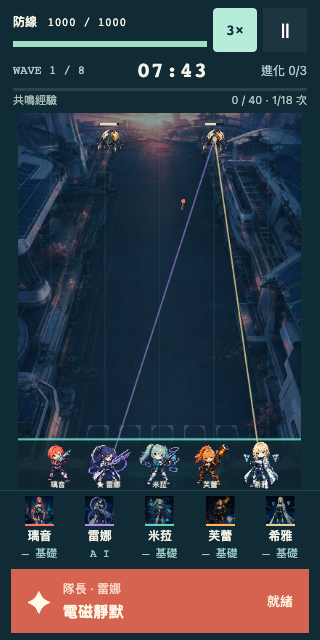

# 戰鬥加速更新

2026-09-04，依使用者要求新增最高 3× 加速。

戰鬥右上角、暫停鍵旁的按鈕循環切換 `1× → 2× → 3× → 1×`，加速時顯示薄荷綠底。按鈕觸控區為 44×44 px，320 px 寬畫面已檢查無重疊或橫向溢出。

加速作用於遊戲時間：敵我移動、攻擊、彈體、傷害效果、冷卻、波次、Boss 與倒數同步推進。模擬仍逐一執行固定 30 Hz 步驟，不跳過規則結算；每幀追趕步數上限隨速度由 5 增至 10／15。選牌、手動暫停、橫放與背景暫停仍停止模擬。音樂與介面動畫使用原有節奏。

速度儲存於本地偏好 `battleSpeed`，只有 1、2、3 合法。舊存檔沒有此欄位時補上 1，不修改戰局或清除進度，因此保留既有內容版本。每次切換立即保存；定期存檔仍按每五秒現實時間執行。重新整理時沿用既有的暫停復原流程，再以保存的速度繼續。

## 驗證

- 規則／存檔 **91/91** 通過，新增舊存檔遷移與非法速度保留測試：[報告](../artifacts/validation/speed-update/rule-results.json)。
- Chromium／WebKit 流程 **12/12** 通過，包含原流程回歸、速度循環、3× 暫停、3× 選牌停止與重載後偏好恢復：[報告](../artifacts/validation/speed-update/browser-results.json)。
- 實際推進速率（每秒模擬步數）：Chromium 為 **30.68／59.03／89.27**，WebKit 為 **29.90／58.92／89.63**，對應 1×／2×／3×；短時間取樣允許 ±10% 排程差異。[Chromium](../artifacts/validation/speed-update/chromium.json)、[WebKit](../artifacts/validation/speed-update/webkit.json)。
- TypeScript 與正式 build 通過。正式版驗收使用 UI 切到 3×，實際等待取得改造、刷新並核對本地快照與 3× 設定：[正式驗收](../artifacts/validation/speed-update/production/smoke.json)。

這次沒有變更武器數值、敵人或關卡規則。原版 30 局構築與效能證據保留在原交付報告；本次桌面瀏覽器速度測試不代表已驗證真手機在最高密度下也能持續達到 3×。
