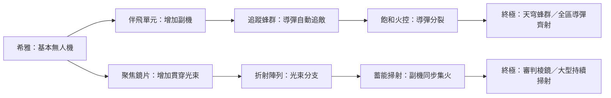

# 星骸防線：升級、三選一卡牌與終極分支研究

研究日期：2026-10-10。範圍：生存 Roguelite、隨機構築塔防，以及本作目前的升級流程。本文供方向討論，未更動遊戲規則。

## 研究結論

**建議方向：戰鬥中獲得升級後，以三選一完成一次強化；每位角色有可追求的短路線，通往不同的特殊攻擊終極技。**

三選一的目標是縮短操作，但成長感還取決於「多久拿到一次」「這次攻擊改變了什麼」「距離成形還差幾次」。目前最需要一起調整的是這三件事。若沿用原本的大量前置與波末等待，只把技能樹畫成卡牌，預期改善會有限。

本次研究六款遊戲，發現少量隨機選項很常見，但選項並不統一為三個；武器進化、組合技、超頻與主動大招也各有不同。最適合本作參考的是《20 Minutes Till Dawn》的分支與武器變體、《Deep Rock Galactic: Survivor》的階段改造，以及《Rogue Tower》的前置卡解鎖。《Brotato》和《Towerful Defense》則提供保留波間決策的對照。

以下將外部機制、本作程式事實、設計推論分開。沒有真人測試支持的秒數與成效，均列為待驗證目標。

## 一、同類遊戲怎麼做

比較以 PC 常規玩法為主；DLC、角色、難度及特殊模式可能有例外。「社群」代表機制細節來自社群 Wiki，並非開發商保證。

| 遊戲 | 升級何時選、選幾個 | 路線如何成形 | 終點與本作可借用之處 |
| --- | --- | --- | --- |
| **Vampire Survivors** | 經驗升級時暫停；常規三或四選一，第四格受 Luck 影響。 | 取得武器與被動、重複升級，湊成指定配方。 | 常見進化需要武器滿級、所需被動及符合條件的寶箱；不是每條路都新增主動大招。適合借用「組件→進化」的期待感。社群來源：[升級](https://vampire-survivors.fandom.com/wiki/Level_up)、[進化](https://vampire-survivors.fandom.com/wiki/Evolution)。 |
| **Brotato** | 屬性升級於波末處理，通常四選一；波間另有商店。 | 角色特性、武器種類、屬性與道具相互搭配；同種同階武器可以合成升階。 | 靠整套裝備成形，沒有必要套成統一的終極技能樹。適合借用短文字、重抽與商品鎖定。官方：[波間節奏](https://store.steampowered.com/app/1942280/Brotato/)；社群：[屬性升級](https://brotato.wiki.spellsandguns.com/Upgrades)、[經驗](https://brotato.wiki.spellsandguns.com/Experience)、[商店](https://brotato.wiki.spellsandguns.com/Shop)。 |
| **20 Minutes Till Dawn** | 普通升級通常五選一，Darkness 9 起減為四個；與武器進化的三選一分開。 | 一般升級有前置分支，跨分支還有協同；武器另有變體選擇。 | 官方 1.0 公告明列：局內角色達等級 20，可從該武器三個變體選一。這是「里程碑選擇攻擊形態」的直接案例，不表示變體一定由先前選牌唯一決定。官方：[1.0 公告](https://steamcommunity.com/games/1966900/announcements/detail/3675547066618941165)；社群：[普通候選數](https://20minutestilldawn.wiki.gg/wiki/Shana)、[分支](https://20minutestilldawn.wiki.gg/wiki/Upgrades)。 |
| **Deep Rock Galactic: Survivor** | 普通升級通常三選一，數量依據為 [1.0 時期媒體評測](https://gameluster.com/deep-rock-galactic-survivor-review-rock-stone-and-bullets/)；武器超頻是另一層選擇。 | 持續投資武器，再於階段取得 Overclock；可改變武器行為，並搭配類型標籤。 | 借用「平常成長＋階段質變」。官方 1.0 回顧確認已取消「先把新武器練到 12 級、之後才可取得超頻」的早期門檻；首次使用即可進行這套成長。官方：[武器設計](https://steamcommunity.com/games/2321470/announcements/detail/3971679674351840364)、[1.0 回顧](https://steamcommunity.com/games/2321470/announcements/detail/534361794856091730)。 |
| **Rogue Tower** | 局內隨機取得新塔與升級卡；本次未核實固定候選數。 | 選過的卡能開啟後續卡；塔種、狀態與特殊效果共同構築。 | 官方 v1.0.12 曾明列 Sorcery I 解鎖 Life Steal I，證明卡牌仍可保留前置關係。適合借用「只呈現當前可走的下一步」。官方：[機制說明](https://store.steampowered.com/app/1843760/Rogue_Tower/?l=english)、[前置卡公告](https://steamcommunity.com/games/1843760/announcements/detail/3126064791590359353)。 |
| **Towerful Defense: A Rogue TD** | 非無盡流程為 20 波，每波後進商店；未核實固定三選一。 | 固定單塔，搭配技能升階、強化、特性與支援單位。 | 與固定防線更接近；官方也提供自動施放模式。最多四個技能是裝備容量，不能當成選牌數。官方：[玩法說明](https://minifun.games/td/)、[技能階級與重抽成就](https://steamcommunity.com/stats/2453610/achievements)。 |

這個樣本支持「一次只看少量有效選項」，不足以證明三選一是所有同類遊戲的標準。對本作採三選一的理由，是五人隊伍已經需要辨認角色、效果與路線，預期三張較容易同時看懂；仍需用選牌時間與理解程度驗證。

### 三種值得分清楚的成形方式

| 方式 | 玩家在追求什麼 | 優點 | 本作採用時的風險 |
| --- | --- | --- | --- |
| **配方進化** | 湊齊指定技能與條件，得到進化效果。 | 發現組合的樂趣強，適合重玩。 | 缺一個前置就可能整局未成形；需要配方提示與補救。 |
| **階段分支** | 投資同一武器或路線，到門檻選擇改造。 | 距離目標清楚，較容易安排首次質變。 | 分支若只是不同增傷倍率，仍缺乏玩法差異。 |
| **裝備協同** | 讓多個屬性、武器與效果互相放大。 | 路線自由，途中容易轉向。 | 終點較不具象，未必符合「我要練出不同大招」的期待。 |

這是依上述案例整理的設計分類，不是各遊戲共用的官方術語。卡片在這裡是升級選項，不需要另外加入抽牌、棄牌、手牌等牌組遊戲規則。

兩個具體例子可幫助判斷「路徑」要做到哪一層。《20 Minutes Till Dawn》的社群資料記錄，Frost Fire 需先取得 Intense Burn 與 Frostbite，才會進入可選升級；條件齊全與實際取得仍是兩步。《DRG: Survivor》2026 年 1.1 官方公告則明列，Sidearm 超頻可開啟 Ultimate Sidearm 不穩定超頻，多把武器具有相同標籤時還能打開相應升級卡。前者偏向配方，後者把單一武器改造接到整套武器協同。來源：[20MTD 協同，社群索引](https://20minutestilldawn.wiki.gg/wiki/Synergies)、[DRG:S 1.1 官方公告](https://steamcommunity.com/games/2321470/announcements/detail/675119576448500283)。

## 二、目前本作為何容易感覺慢

以下以目前工作區的新戰局規則 `balanceVersion: 7`、`experienceVersion: 4` 為準，並以 S01 說明。

### 1. 得到經驗與完成強化的時間分開

普通波必須清完敵人，並等敵方投射物與排程攻擊結束，才進入配點。玩家即使已累積經驗，也要等波末才能使用；波末又可能一次處理數點。這會形成「一段時間只戰鬥，再停下來做一批選擇」的節奏。程式依據：[波次結束條件](/Users/willcoming/code/SurvivalTowerDefense/src/sim/wave-flow.ts)、[戰鬥流程](/Users/willcoming/code/SurvivalTowerDefense/src/sim/engine.ts)。

**推論：** 若想更快感受到成長，應縮短「賺到升級→選擇→看見效果」的間隔。只增加 XP，可能變成每次波末要處理更多點。

### 2. 五人共用資源，平均分配很難快速成形

S01 有 10 個普通波及 20 點技能預算。按目前經驗曲線，各普通波清完後的累計點數為：

| 波末 | 1 | 2 | 3 | 4 | 5 | 6 | 7 | 8 | 9 | 10 |
| --- | --- | --- | --- | --- | --- | --- | --- | --- | --- | --- |
| 累計點數 | 1 | 3 | 5 | 7 | 9 | 11 | 13 | 15 | 17 | 20 |

角色取得終極技前至少要已有四個普通節點，終極本身花兩點，因此至少需要六點。若 20 點平均分給五人，每人只有四點；把點数持續分散，會延後任何一位角色的大招。這是資源結構的結果，並非玩家操作錯誤。程式依據：[點數曲線](/Users/willcoming/code/SurvivalTowerDefense/src/data/battle-experience.ts)、[取得條件與花費](/Users/willcoming/code/SurvivalTowerDefense/src/sim/deep-tree.ts)。

### 3. 選項很多，終點差異卻不足

目前每位角色有 24 個節點，五人合計是 120 個潛在節點，並非同時全部可選；但每位角色在同一造型下只有一個終極技。分支投資可能改變普攻與支援，卻沒有通往不同大招。這與你期待的「不同路徑→不同終極技能」有明確落差。程式依據：[技能生成與終極定義](/Users/willcoming/code/SurvivalTowerDefense/src/data/reworked-skills.ts)、[現行分支加工](/Users/willcoming/code/SurvivalTowerDefense/src/data/tactical-skills.ts)。

例如希雅的「追蹤導彈」是普通分支效果，原裝終極仍為「棱鏡增幅幕」。如果希望終點是蜂群齊射或大型光束，必須新增對應技能行為與分支規則，單改卡片名稱無法達成。

### 4. 解鎖後還可能繼續等

現行程式在解鎖終極後，先等待完整冷卻；各造型定義約為 24～36 秒，部分技能還有觸發條件。因此「點到了」與「第一次看見大招」又隔了一段。程式依據：[解鎖時設定冷卻](/Users/willcoming/code/SurvivalTowerDefense/src/sim/weapons.ts)、[冷卻與觸發條件](/Users/willcoming/code/SurvivalTowerDefense/src/data/reworked-skills.ts)。

此外，最近的前期難度調整增加敵軍量，但 S01 仍維持 20 點。它可能加重相同升級次數之間的等待感；這是待實測的解釋，不能用自動戰鬥模擬時間當成人類體感證據。變更依據：[前期難度紀錄](/Users/willcoming/code/SurvivalTowerDefense/docs/EARLY_DIFFICULTY_REWORK.md)。

## 三、三個可討論的方向

下表是本作設計判斷，不是競品成效統計。

| 方向 | 實際玩法 | 成長與路線感 | 主要代價 |
| --- | --- | --- | --- |
| **A．三選一＋短分支終極（建議）** | 經驗滿就選一張；持續投資一條角色路線，幾次選擇後取得該路線的大招。 | 較快、目標清楚，最符合這次需求。 | 需要重做卡池、不同終極行為與成長平衡。 |
| **B．三選一＋跨技能配方** | 收集不同角色或標籤的組件，合成新的特殊攻擊。 | 發現感與隊伍搭配更強。 | 缺料、配方學習與隨機卡手風險最高。 |
| **C．波末三選一＋分支終極** | 保留完整波次，波末以短卡牌流程取代大技能樹，重新設計分支終點。 | 操作變快、戰鬥較少中斷。 | 波內等待依然存在；需靠更短的波或更強的單次升級補足。 |

建議先做 A 的小型試玩版，再決定是否加入 B 的跨角色組合。C 適合你最在意完整看完一波戰鬥的情況。三個方向都可以有不同終極；差別在於何時選擇、路線有多可控。

## 四、建議方案 A 的具體樣子

### 升級節奏：一次選擇，立刻回到戰鬥

擊殺獲得隊伍經驗，進度滿後在合適的短暫節點暫停，直接呈現三張卡。選中一張即生效並恢復戰鬥，不再先選角色、進技能樹、累積多點後確認。每張卡自己標明受益角色。

以一局約四到五分鐘的測試關卡為假設，先測以下目標；它們不是已驗證的最佳數值，也不是競品的實測秒數：

| 項目 | 首輪測試目標 |
| --- | --- |
| 第一個選牌機會 | 開戰約 10～15 秒 |
| 前兩分鐘 | 大致每 15～20 秒戰鬥時間一次選牌 |
| 中後段 | 放慢至約 25～30 秒，避免頻繁打斷大招與首領戰 |
| 一局主升級選擇 | 約 12～16 次，依關卡長度調整 |
| 第一條終極路線 | 集中投資時，約 60～90 秒能完成 |
| 終極首次展示 | 取得後遇到合法目標即可先施放一次，再開始一般冷卻 |

最後一項要保留技能的必要條件，例如戰場無敵人時不空放。選牌暫停應凍結整個戰鬥狀態，避免玩家閱讀時仍被攻擊；首領演出中則延至演出結束處理。

上述選擇次數是新系統的強化單位，**不與舊版 20 點一比一換算**。例如戰鬥時間第 12、28、44、60、80、100、125、150、175、200、225、250 秒各一次，就是 250 秒內 12 次選擇；可先用這種節奏作對照，再調整經驗門檻。實際發放仍應有清楚的經驗規則，不暗中無條件按秒送等級。

### 路線：每次都有作用，第四次看到終極

先用「同一路線三次強化＋一次終極」作試驗。前三張都應有即時收益，其中多數要能從攻擊行為看出改變；第四張才是完整特殊攻擊。本次剛完成第三張前置的路線，下一次選牌固定提供其終極卡。玩家若略過，該終極仍保持可取得，但轉入後續輪替候選。

每位角色先規劃兩條差異清楚的終極路線。取得某條終極後，鎖定該角色本局的另一個終極；一般輔助卡仍可混搭。互斥規則必須在選卡時顯示。每局集中養成兩到三位主力是合理目標，其他隊員開場就有基本戰力，不需要先抽到卡才能攻擊。

以 12～16 次選擇計算，兩條終極花 8 次，剩 4～8 次分配其他強化；三條終極花 12 次，只剩 0～4 次。首輪以兩條成形加輔助搭配為主，三條屬於集中投資的取捨，不保證五人全有大招。

**希雅示例，以下名稱與效果均為新設計草案：**

兩條路線的終點分別處理分散敵群與密集／高耐久目標；攻擊方式、目標選擇、畫面與音效都應可辨識。具體傷害、射程及冷卻在試玩後配置。不要讓兩個終極只剩「紅色傷害加成」與「藍色傷害加成」的差異。

### 三張卡的出現規則：隨機中保留可追求的路

五人隊伍直接從所有節點等機率抽三張，容易稀釋需要的路線。建議原型先採有條件的候選池：

- 有正在投資且可繼續的路線時，至少一張提供後續強化；剛完成第三張前置的路線，下一輪這一格固定提供其終極。
- 其餘位置提供另一位角色的有效強化，或已能受益的隊伍協同；開場則提供不同角色的入口卡。
- 僅加入已出戰角色、已達前置且未滿級的卡；排除已被互斥規則鎖住的選項。
- 先提供每局兩次免費重抽作測試，重抽後仍遵守前置與路線保底；暫不一次加入封印、鎖卡、商店等多套操作。

這些保底與次數是本作提案，不是上述遊戲的通用規則。若出現多條同時待成形的路線，候選應輪替，避免只有最近點過的角色持續獲得關照。

卡面保留「角色、立即效果、路線進度、最終方向」四個資訊。例如：

> **希雅｜追蹤蜂群**  
> 無人機追加自動追蹤導彈。  
> 蜂群路線 2／4 → 天穹蜂群

全路線圖可以保留為查看資訊的地方，日常升級不必每次進圖操作。純數值卡仍可存在，應有明顯收益，並避免為了通往終極被迫連續選多張微幅加成。

### 終極怎麼施放

「特殊攻擊」與「必須手動」可以分開決定。考量五人隊伍的操作量，首輪建議沿用自動施放，讓路線決定攻擊形式；保留後續加入單一集體爆發指令的可能。若你希望操作大招時機，才另外比較手動保留與自動模式，避免升級改造一次承擔兩套系統的驗證。

## 五、怎樣判斷改造真的有改善

先做兩位角色、每位兩條路線、同一個短關卡的試玩對照。固定出戰名單與敵軍配置，比較舊流程與新卡牌流程；這樣比較容易知道改善來自升級，而非同時把敵人變弱。

| 要回答的問題 | 記錄方式／初步目標 |
| --- | --- |
| 是否更早感到角色變強？ | 第一個選牌時間，以及選完後第一次看見新增攻擊效果的時間，分別記錄。 |
| 選牌是否更快？ | 新玩家選牌中位數先以 3 秒內、九成選擇在 6 秒內為目標；複雜終極選擇另記。 |
| 能否讀懂路線？ | 選完第二張後，請玩家說明正在養誰、預期終極做什麼、還差幾次。 |
| 隨機是否阻礙成形？ | 記錄前置齊全卻看不到終極的次數，以及想繼續路線卻連續沒有後續卡的情況。 |
| 不同終極是否值得重玩？ | 讓同一人換路線再玩，觀察是否改變目標處理與配隊，而非只有清怪數值不同。 |
| 戰鬥是否被打斷太多？ | 分別記錄戰鬥時間、閱讀時間與演出時間；詢問首領戰的中斷感。 |

這些目標應先由少量真人試玩校正，不能以自動策略必勝當成「有趣」的證明。平衡檢查則另外確保：終極提前後敵軍仍有壓力、未成形路線也有基本生存空間、兩條路不因單純倍率而出現固定最優解。

若方向通過，再處理完整角色卡池、舊存檔與回放版本、角色造型差異，以及「禁終極／限兩次進化」等既有挑戰的相容規則。

## 六、來源界線與下一步討論

本次優先查閱開發商網站、Steam 官方商店與公告，再用社群 Wiki 補足候選數與前置規則。這是機制比較與本作程式檢查，沒有進行六款遊戲同條件計時，也沒有用論壇抱怨推算問題普及率。

- Vampire Survivors 新官方 Wiki 本次無法讀取，精確機制採用可檢索的舊 Fandom 資料；特殊模式與最新例外未逐一核實。
- 20 Minutes Till Dawn 社群 Wiki 部分頁面僅能取得搜尋索引內容；普通候選數與分支規則可信度低於其官方 1.0 武器進化公告。
- DRG: Survivor 的早期武器介紹包含過時的首次超頻解鎖門檻，已以較新的官方回顧修正；不能把原版 Deep Rock Galactic 的改裝規則混入 Survivor。
- Rogue Tower 與 Towerful Defense 未確認固定候選數，因此未拿它們支持「都是三選一」。商店商品數、技能裝備槽、一次獎勵數也沒有混為同一件事。

**下一步最值得先決定：要採 A「升級即選、短路線通往不同大招」，還是 C「保留波末選擇、縮短配點並加入不同大招」？** 我建議先選 A 做小型試玩，再根據中斷感決定是否往 C 靠攏。跨角色配方 B 可以放到第二階段。
